class: inverse, center, middle


```{r setup, include=FALSE}
options(htmltools.dir.version = FALSE)
```

# Oculomotor Cues

###	Compare and contrast the different cues that signal depth perception.
---
class: clear


---

# Perceiving Depth and Size

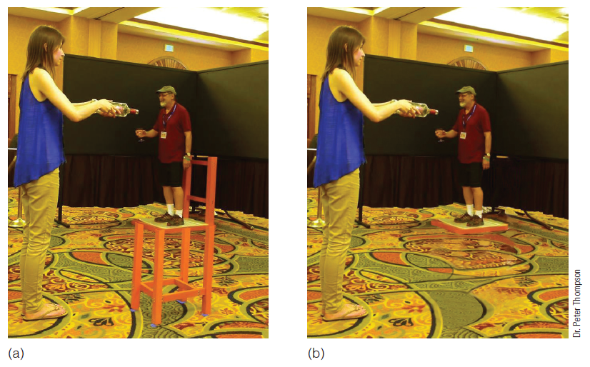

???

Figure 10.1 (a) Misperception of the man’s depth leads to an incorrect perception of his size. (b) When the illusion of the “chair” is removed, the man’s actual depth can be determined, and he appears to be of normal height. 

---

# Perceiving Depth
.pull-left[
- Cue approach to depth perception:
    - Focuses on information in the retinal image that is correlated with depth in the scene
    - Occlusion
- We learn the connection between the cue and depth.
- The association becomes automatic through repeat exposure.
]
.pull-right[
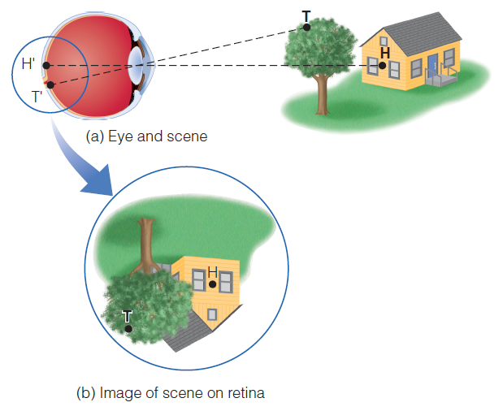
]

???

Figure 10.2 (a) In the scene, the house is farther away than the tree, but images of points H on the house and T on the tree fall on points H’ and T’ on the two-dimensional surface of the retina on the back of the eye. (b) These two points on the retinal image, considered by themselves, do not tell us the distances of the house and the tree


---
class: clear

.pull-left[

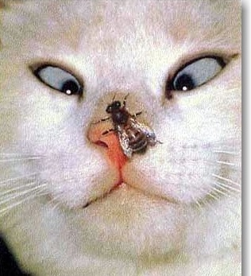

]
.pull-right[

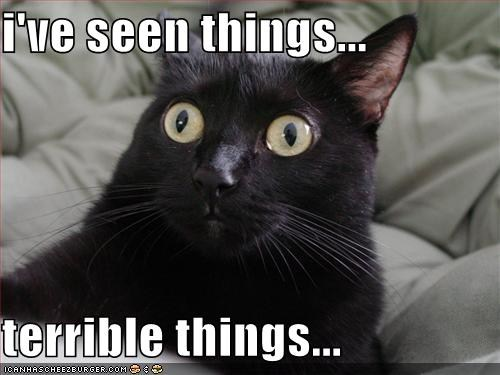

]

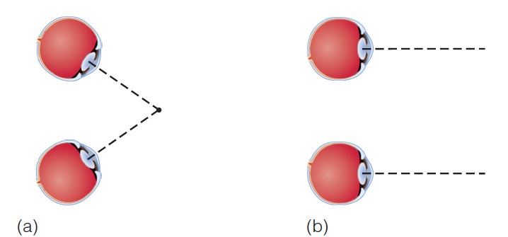


???

Figure 10.3 (a) Convergence of the eyes occurs when a person looks at something that is very close. (b) The eyes look straight-ahead when the person observes something that is far away


---

# Oculomotor Cues
Oculomotor cues are based on sensing the position of the eyes and muscle tension.
- **Convergence**: foveate on nearby objects
   - inward movement of the eyes
   - cilliary muscles tighten lens
- **Accommodation**: foveate on far away objects
   - outward movement of the eyes
   - cilliary muscles relax lens


---
class: inverse, center, middle

# Monocular Cues

###	List and define the different pictorial cues with examples.

---

# Monocular Cues
- Monocular cues come from one eye
    - **Pictorial cues**: sources of depth information that come from 2-D images, such as pictures
    - **Occlusion**: when one object partially covers another
    - **Relative height**: objects below the horizon that are higher in the field of vision are more distant.
- Objects above the horizon lower in the visual field are more distant.

---

# Monocular Cues
- **Relative size**: when objects are equal size, the closer one will take up more of your visual field.
- **Perspective convergence**: parallel lines appear to come together in the distance.
- **Familiar size**: distance information is based on our knowledge of object size.

---

# Monocular Cues

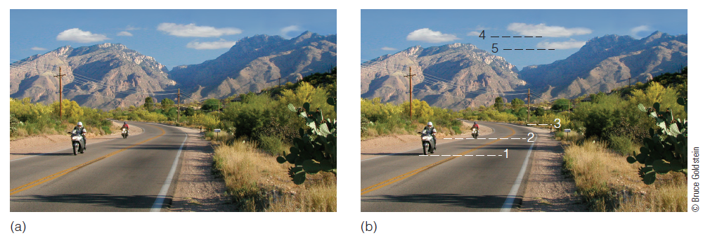

???

Figure 10.4 (a) A scene in Tucson, Arizona, containing a number of depth cues: occlusion (the cactus on the right occludes the hill, which occludes the mountain); relative height (the far motorcycle is higher in the field of view than the closer one); relative size (the far motorcycle and telephone pole are smaller than the near ones); and perspective convergence (the sides of the road converge in the distance). (b) 1, 2, and 3 indicate the increasing height in the field of view of the bases of the motorcycles and the far telephone pole, which reveals that being higher in the field of view causes objects on the ground to appear farther away; 4 and 5 reveal that being lower in the field of view causes objects in the sky to appear farther away, so cloud 4 is closer to the viewer than cloud 5.


---

# Monocular Cues
- **Atmospheric perspective**: distance objects are fuzzy and have a blue tint.
- **Texture gradient**: equally spaced elements are more closely packed as distance increases.
- **Shadows**: indicate where objects are located
    - Enhance 3-D of objects

---

# Monocular Cues

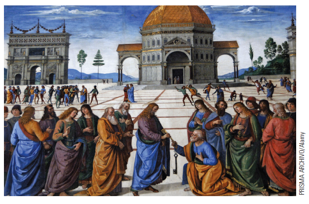

???

Figure 10.6 Pietro Perugino, Christ Handing the Keys to St. Peter(Sistine Chapel). The convergence of lines on the plaza illustrates perspective convergence. The sizes of the people in the foreground and middle ground illustrate relative size.

---

# Monocular Cues

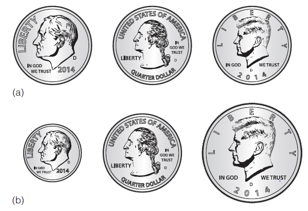
 
???

Figure 10.5 (a) Drawings of coins similar to the photographs used in Epstein’s (1965) familiar-size experiment. Each coin was depicted as being the same size as the quarter. (b) The actual relative sizes of a dime, quarter, and half-dollar

---

# Monocular Cues

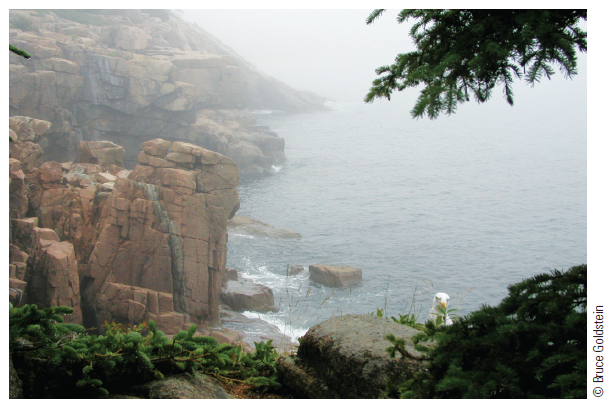

???

Figure 10.7 A scene on the coast of Maine showing the effect of atmospheric perspective

---

# Monocular Cues

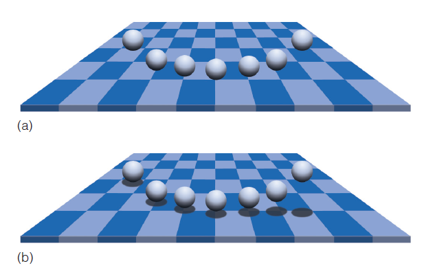

???

Figure 10.9 (a) Where are the spheres located in relation to the checkerboard? (b) Adding shadows makes their location clearer. 

---

# Monocular Cues

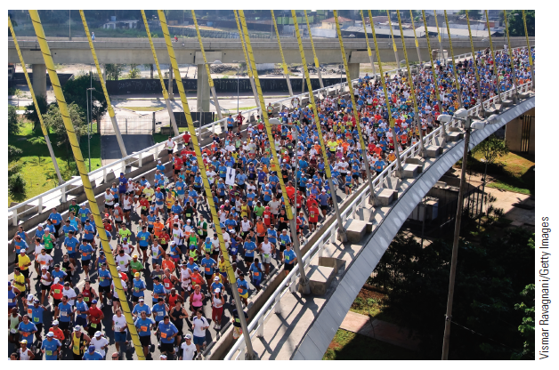

???

Figure 10.8 Texture gradient created by marathon runners. The increasing fineness as distance increases enhances the perception of depth. 


---

# Monocular Cues


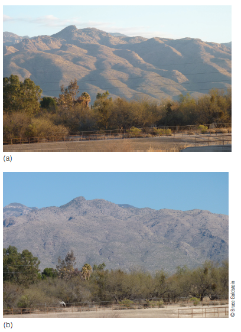


???

Figure 10.10 (a) Early morning shadows emphasize the mountain’s contours. (b) When the sun is overhead, the shadows vanish and it becomes more difficult to see the mountain’s contours. 

---

# Motion-Produced Cues
- **Motion parallax**: close objects in direction of movement glide rapidly past but objects in the distance appear to move slowly.
- **Deletion and accretion**: objects are covered or uncovered as we move relative to them.
    - Covering an object is *deletion*
    - Uncovering an object is *accretion*

---

# Motion-Produced Cues

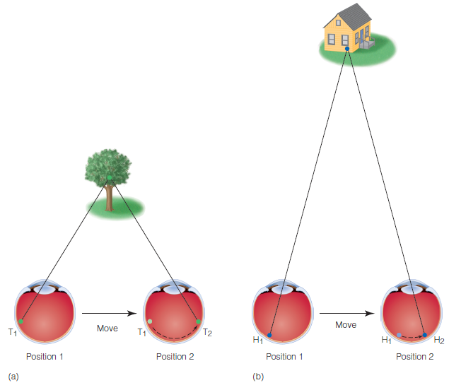

???

Figure 10.11 One eye moving past (a) a nearby tree; (b) a faraway house. Because the tree is closer, its image moves farther across the retina than the image of the house. 

---

# Monocular Cues 

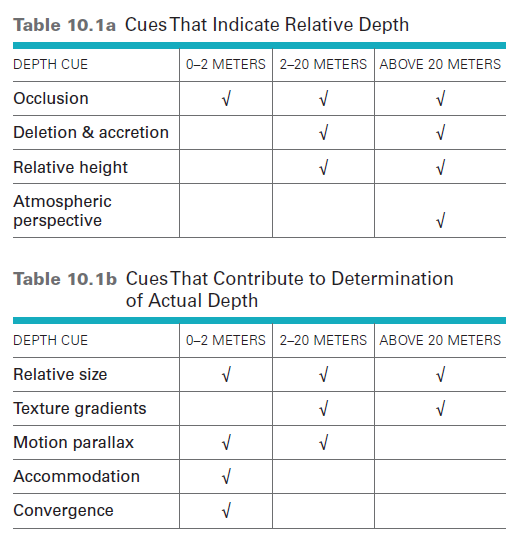


???

---

### Links to demos

http://www.michaelbach.de/ot/mot-ske/index.html

http://www.michaelbach.de/ot/sze-Necker/index.html

http://www.michaelbach.de/ot/col-equilu/index.html

---
class: inverse, center, middle

# Binocular Depth Information

###	Explain how binocular disparity results in depth perception.
###	Discuss how random-dot stereograms are created and their importance, explain what the correspondence problem is.


---
class: clear
background-image: url(xkcd_monroe.jpg)
background-size: 100%


---
class: clear
background-image: url(depth_perception.png)
background-size: 58%

???

https://xkcd.com/941/large/
https://xkcd.com/1080/large/

https://imgs.xkcd.com/comics/depth_perception.png

---
# Binocular Depth Information
- Stereoscopic depth perception
    - Depth perception created by input from both eyes


---
class: clear
background-image: url(3d-cannon.jpg)
background-size: 100%


---
# Binocular Depth Information
- Stereoscopic depth perception
    - Depth perception created by input from both eyes


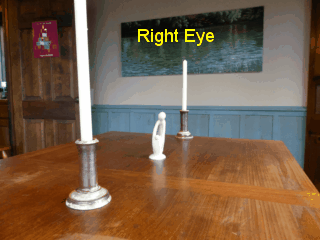


---

# Seeing Depth With Two Eyes
- Differences between 2D and 3D movies
    - "Stereo Sue"
    - Strabismus

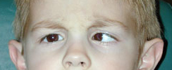
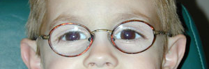


---
# Two Eyes: Two Viewpoints  


.pull-left[
## .red[Right Eye Closed]
]

.pull-right[
## .blue[Left Eye Closed]
]

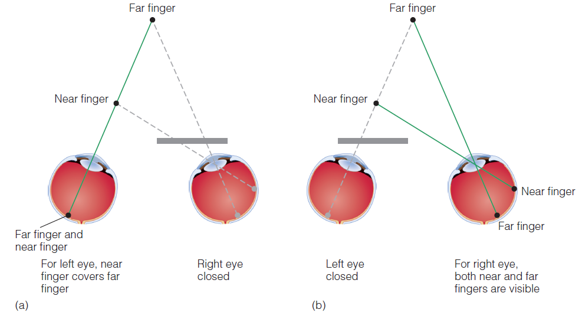

???

Figure 10.13 Location of images on the retina for the “Two Eyes: Two Viewpoints” demonstration. 


---

# Seeing Depth With Two Eyes

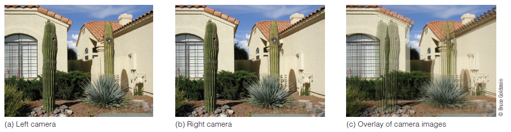

???

Figure 10.14 (a) and (b) 3-D movies are filmed using two side-by-side cameras so that each camera records a slightly different view of the scene. (c) The images are then projected onto the same 2-D surface. Without 3-D glasses, both images are visible to both eyes. 3-D glasses separate the images so that one is only seen by the left eye and the other is only seen by the right eye. When the left and right eyes receive these different images, stereoscopic depth perception occurs. 

---

# Binocular Disparity

.pull-left[
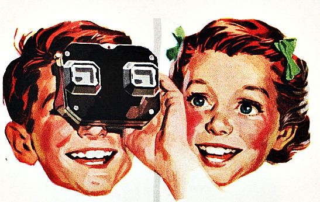
]
.pull-right[
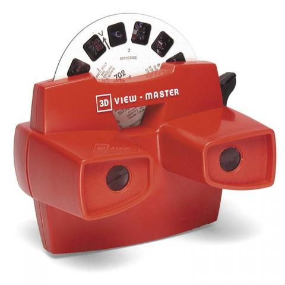
]

---

# Binocular Disparity
- Binocular disparity: difference in images from two eyes
    - Difference can be described by examining corresponding points on the two retinas. 
- The horopter: imaginary sphere that passes through the point of focus
    - Objects on the horopter fall on corresponding points on the two retinas.


---

# Binocular Disparity
.pull-left[
- Objects not on the horopter fall on noncorresponding points
    - These points make disparate images.
    - The angle between these points is the **absolute disparity**.
    - The *amount of disparity* indicates how far an object is from the horopter. 
    - **Relative disparity** is the difference between the absolute disparity of two objects.
]
.pull-right[
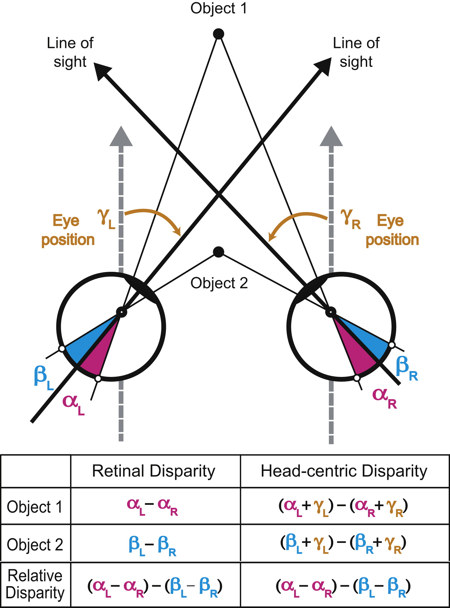
]


---

# Binocular Disparity

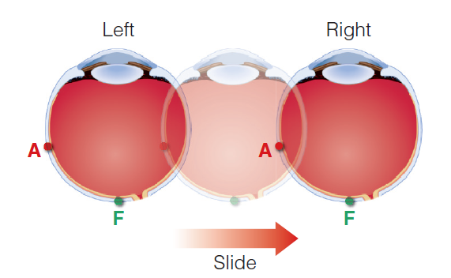

???

Figure 10.15 Corresponding points on the two retinas. To determine corresponding points, imagine that the left eye is slid on top of the right eye. F indicates the fovea, where the image of an object occurs when an observer looks directly at the object, and A is a point in the peripheral retina. Images on the fovea always fall on corresponding points. Notice that the A’s, which also fall on corresponding points, are the same distance from the fovea in the left and right eyes.


---

# Binocular Disparity

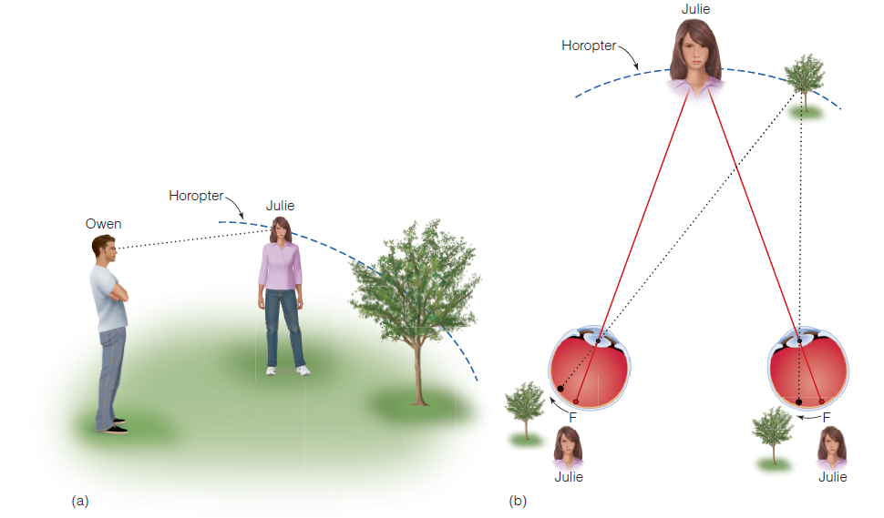

???

Figure 10.16 (a) Owen is looking at Julie’s face, with a tree off to the side. (b) Owen’s eyes, showing where the images of Julie and the tree fall on each eye. Julie’s images fall on the fovea, so they are on corresponding points. The arrows indicate that the tree’s images are located the same distances from the fovea in the two eyes, so they are also on corresponding points. The dashed line in (a) and (b) is the horopter. The images of objects that are on the horopter fall on corresponding points. 


---

# Disparity (Geometrical) Created Stereopsis (Perceptual)

.pull-left[
- Stereopsis: depth information provided by binocular disparity
    - Stereoscope uses two pictures from slightly different viewpoints.
    - Random-dot stereogram has two identical patterns with one shifted in position.
]
.pull-right[
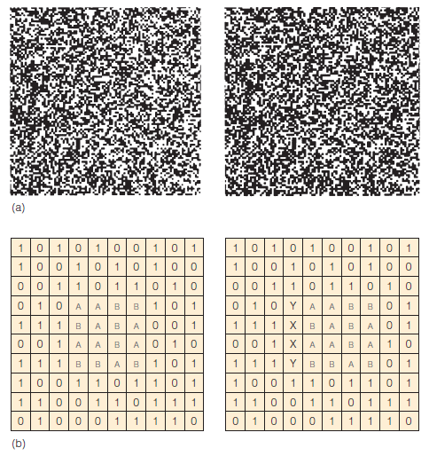
]

???

Figure 10.21 (a) A random-dot stereogram. (b) The principle for constructing the stereogram. See text for explanation. 

---

# Autostereograms

.pull-left[
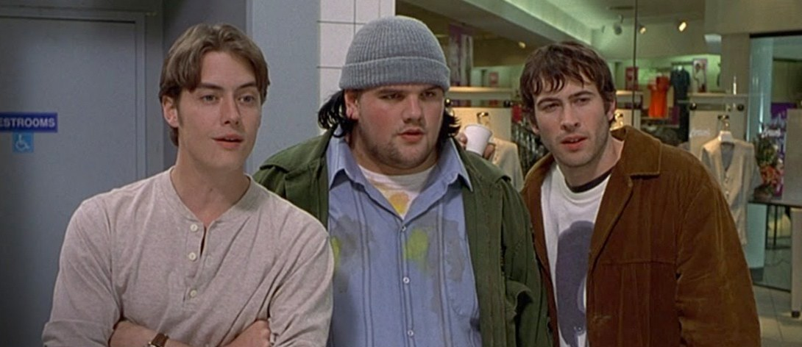
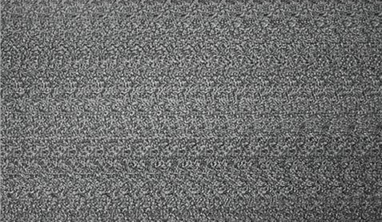
]
.pull-right[
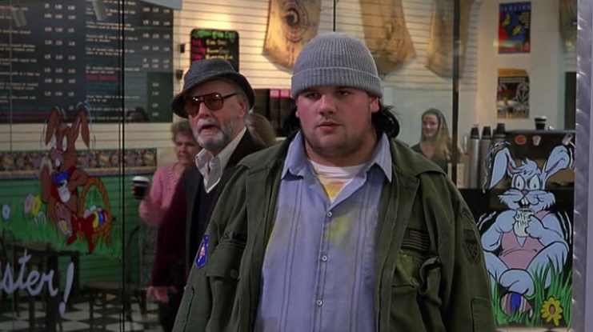
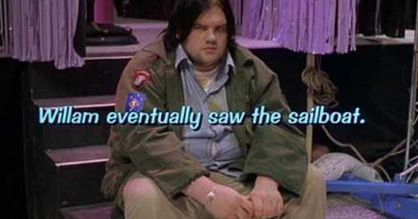
]

http://peeinears.github.io/MagicEye.js/


---

# The Correspondence Problem
- How does the visual system match images from the two eyes?
    - Matches may be made by specific features of objects.
    - This may not work for objects like random-dot stereograms.
    - A satisfactory answer has not yet been proposed.


---
class: inverse, center, middle

# The Physiology of Binocular Depth Perception

###	Outline the anatomy and physiology of depth perception.

---

# The Physiology of Binocular Depth Perception
- Neurons have been found that respond best to binocular disparity.
    - These are called binocular depth cells or disparity selective cells.
- These cells respond best to a specific degree of absolute disparity between images on the right and left retinas.
    - Disparity tuning curve

---

# The Physiology of Binocular Depth Perception

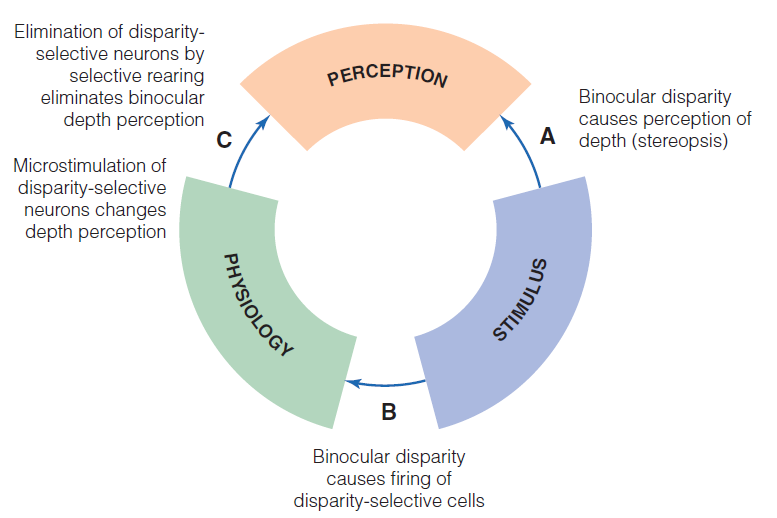

???

Figure 10.26 The three relationships in the perceptual process, as applied to binocular disparity. We have described experiments relating disparity to perception (A) and relating disparity to physiological responding (B). The final step is to determine the relationship between physiological responses to disparity and perception (C). This has been studied by selective rearing, which eliminates disparity-selective neurons, and by microstimulation, which activates disparity-selective neurons. 


---

# The Physiology of Binocular Depth Perception
- Experiment by Blake and Hirsch
    - Cats were reared by alternating vision between two eyes.
    - Results showed that they:
- Had few binocular neurons
- Were unable to use binocular disparity to perceive depth

---

# The Physiology of Binocular Depth Perception
.pull-left[
- Experiment by DeAngelis et al.
    - A monkey was trained to indicate depth from disparate images.
    - Disparity-selective neurons were activated by this process.
    - Experimenter used microstimulation to activate different disparity-selective neurons.
    - The monkey shifted judgment to the artificially stimulated disparity.
]

.pull-right[
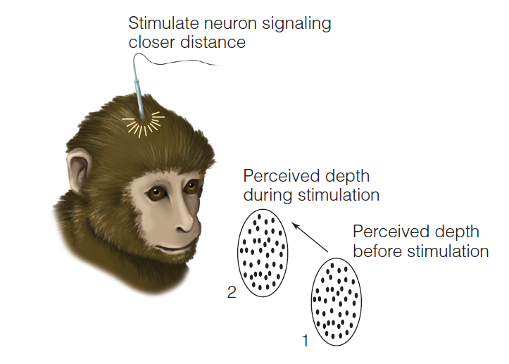
]

???

Figure 10.27 While the monkey was observing a random-dot stereogram, DeAngelis and coworkers (1998) stimulated neurons in the monkey’s cortex that were sensitive to a particular amount of disparity. This stimulation shifted the monkey’s perception of the depth of the field of dots from position 1 to position 2


---
class: inverse, center, middle

# Perceiving Size

###	Discuss the method, results, and implications of Holway and Boring’s “hallway” research.
###	Define size constancy and state the size-distance scaling equation and its components.


---

# Perceiving Size
- Distance and size perception are interrelated.
- Experiment by Holway and Boring
    - Observer was at the intersection of two hallways.
    - A luminous test circle was in the right hallway placed from 10 to 120 feet away.
    - A luminous comparison circle was in the left hallway at 10 feet away.


---

# Perceiving Size
- On each trial, the observer was to adjust the diameter of the test circle to match the comparison.
    - Test stimuli all had same visual angle (angle of object relative to the observer's eye).
- Visual angle depends on both the size of the object and the distance from the observer.

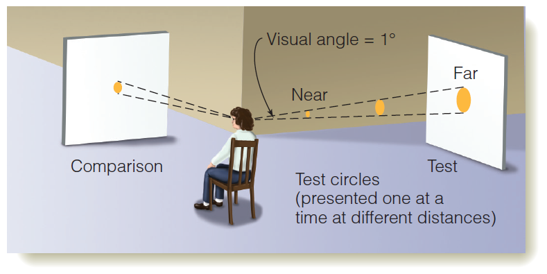

???

Figure 10.29 Setup of Holway and Boring’s (1941) experiment. The observer changes the diameter of the comparison circle in the left corridor to match his or her perception of the size of test circles presented in the right corridor. Each test circle has a visual angle of 1 degree and is presented separately. This diagram is not drawn to scale. The actual distance of the far test circle was 100 feet. 

---

# Perceiving Size
- Part 1 of the experiment provided observers with depth cues.
    - Judgments of size were based on physical size.
- Part 2 of the experiment provided no depth information.
    - Judgments of size were based on size of the retinal images.


---

# Perceiving Size

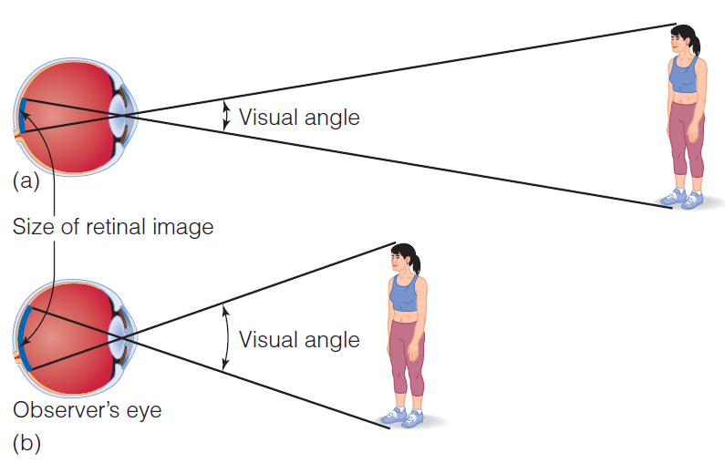

???

Figure 10.30 (a) The visual angle depends on the size of the stimulus (the woman in this example) and its distance from the observer. (b) When the woman moves closer to the observer, both the visual angle and the size of the image on the retina increase. This example shows that halving the distance between the stimulus and the observer doubles the size of the image on the retina. 

---

# Visual Angle


---

# Size Constancy
- Perception of an object's size remains relatively constant.
- This effect remains even if the size of the retinal image changes.
- Size-distance scaling equation
    - S = K (R X D)
    - The changes in distance and retinal size balance each other.

???

- s: actual object size
- r: retinal size
- d: distance
- ignore k (constant)

---

# Size Constancy
- Emmert's law:
    - Retinal size of an afterimage remains constant.
    - Perceived size will change depending on distance of projection.
    - This follows the size-distance scaling equation.

---

# Size Constancy

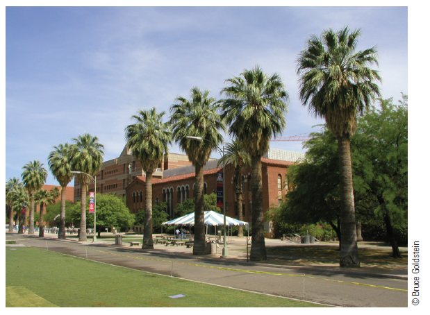

???

Figure 10.35 All of the palm trees appear to be the same size when viewed in the environment, even though the farther ones have a smaller visual angle. 

---

# Size Constancy

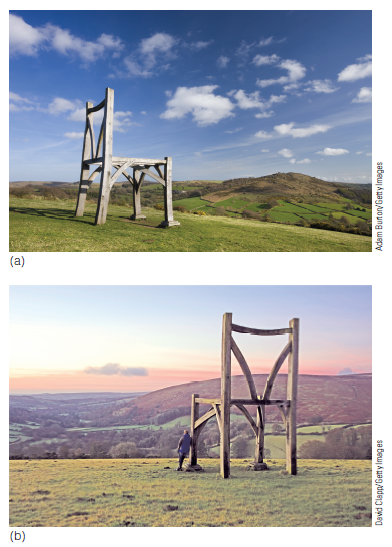

???

Figure 10.37 (a) The size of the chair is ambiguous until (b) a person is standing next to it. 


---

# Size Constancy

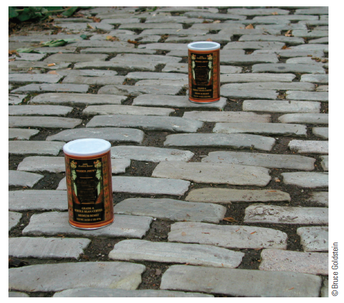

???

Figure 10.38 Two cylinders resting on a texture gradient. The fact that the bases of both cylinders cover the same number of units on the gradient indicates that the bases of the two cylinders are the same size. 

---
background-image: url(eifel_persp.jpg)
background-size: 40%

---
class: inverse, center, middle

# Illusions of Depth and Size

###	Debate the proposed theoretical explanations for the Müller-Lyer, Ponzo, Ames Room, and Moon illusions.

---

# Visual Illusions
- Some illusions can be explained by the connection between the perception of size and the perception of depth. 
- The Müller-Lyer illusion
    - Straight lines with inward fins appear shorter than straight lines with outward fins.
    - Lines are actually the same length.

---

# Visual Illusions

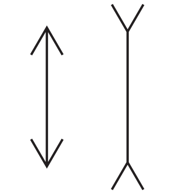

???

Figure 10.39 The Müller-Lyer illusion. Both lines are actually the same length. 


---

# The Müller-Lyer Illusion
- Why does this illusion occur?
    - Misapplied size-constancy scaling:
- Size constancy scaling that works in 3-D is misapplied for 2-D objects.
- Observers unconsciously perceive the fins as belonging to outside and inside corners.
- Outside corners would be closer and inside corners would be further away.

---

# The Müller-Lyer Illusion

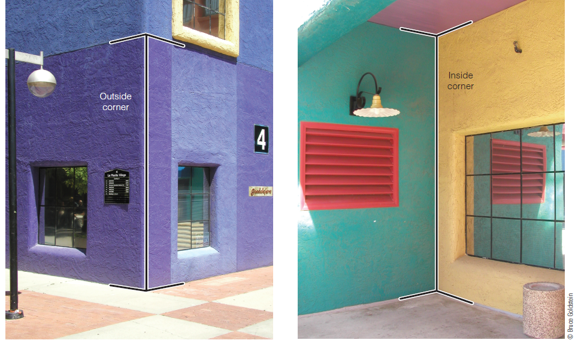

???

Figure 10.40 According to Gregory (1966), the Müller-Lyer line on the left corresponds to an outside corner, and the line on the right corresponds to an inside corner. Note that the two vertical lines are the same length (measure them!). 


---

# The Müller-Lyer Illusion
- Explanation: 
    - Since the retinal images are the same, the lines must be different sizes.
- Problems with this explanation:
    - The "dumbbell" version shows the same perception even though there are no "corners."
    - The illusion also occurs for some 3-D displays.

---

# The Müller-Lyer Illusion
- Another possible explanation:
    - Conflicting cues theory: our perception of line length depends on:
- The actual length of the vertical lines
- The overall length of the figure
    - The conflicting cues are integrated into a compromise perception of the length.

---
background-image: url(cafe-wall.jpg)


---

# The Ponzo Illusion
- Horizontal rectangular objects are placed over railroad tracks in a picture.
- The far rectangle appears larger than the closer rectangle but both are the same size.
- One possible explanation is misapplied size-constancy scaling. 

---

# The Ponzo Illusion

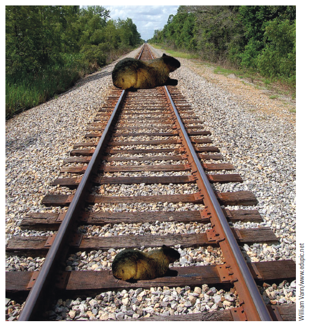

???

Figure 10.44 The Ponzo (or railroad track) illusion. The two animals are the same length on the page (measure them), but the far one appears larger. 

---

# The Ames Room
- Two people of equal size appear very different in size in this room.
- The room is constructed so that:
    - The shape looks like a normal room when viewed with one eye
    - The actual shape has the left corner twice as far away as the right corner

---

# The Ames Room

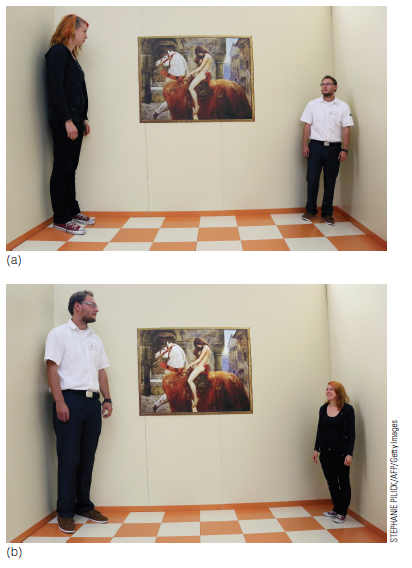

???

Figure 10.45 The Ames room. Although both people are about the same height, (a) the woman appears taller or (b) the man appears taller because of the distorted shape of the room. 

---

# The Ames Room

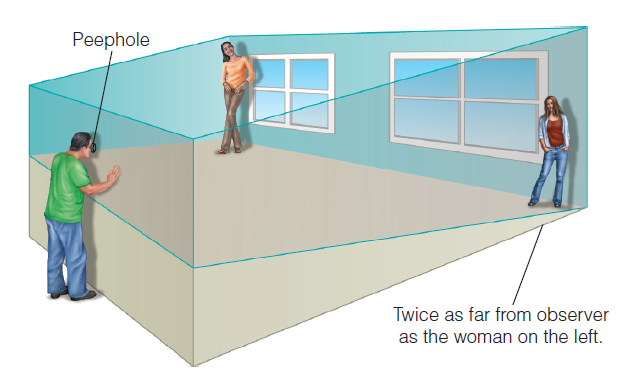

???

Figure 10.46 The Ames room, showing its true shape. The person on the right is actually almost twice as far away from the observer as the person on the left; however, when the room is viewed through the peephole, this difference in distance is not seen. In order for the room to look normal when viewed through the peephole, it is necessary to enlarge the right side of the room. 


---

# The Ames Room
- One possible explanation: size-distance scaling
    - Observer thinks the room is normal.
    - Women would be at same distance.
    - Woman on the left has smaller visual angle (R).
    - Due to the perceived distance (D) being the same, her perceived size (S) is smaller.

---

# The Ames Room
- Another possible explanation: relative size
    - Perception of size depends on size relative to other objects. 
    - One woman fills the distance between the top and bottom of the room.
    - The other woman only fills part of the distance.
    - Thus, the woman on the right appears taller.


---
background-image: url(Boston_moon.JPG)
background-size: cover

---

# The Moon Illusion
- The moon appears larger on the horizon than when it is higher in the sky.
- One possible explanation:
    - Apparent-distance theory: horizon moon is surrounded by depth cues while the moon higher in the sky has none.
    - The horizon is perceived as further away than the sky, and called "flattened heavens".

---

# The Moon Illusion
- Explanation: 
    - Since the moon in both cases has the same visual angle, it must appear larger at the horizon.
- Another possible explanation:
    - Angular size-contrast theory: the moon appears smaller when surrounded by larger objects.
    - Thus, the large expanse of the sky makes it appear smaller.
- Actual explanation may be a combination of a number of cues.

---

# The Moon Illusion

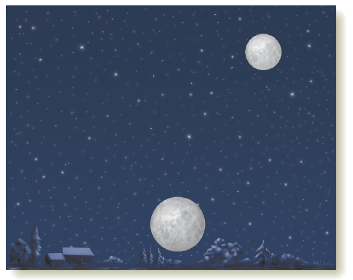

???

Figure 10.47 An artist’s conception of the how the moon is perceived when it is on the horizon and when it is high in the sky. Note that the visual angle of the horizon moon is depicted as larger than the visual angle of the moon high in the sky. This is because the picture is simulating the illusion. In the environment, the visual angles of the two moons are the same.


---

# The Moon Illusion

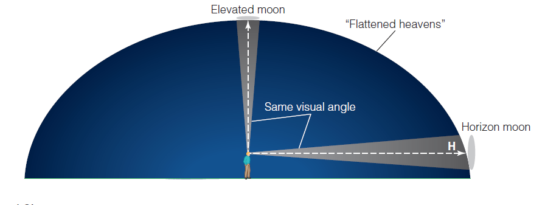

???

Figure 10.48 When observers are asked to consider the sky as a surface and to compare the distance to the horizon (H) with the distance to the top of the sky on a clear moonless night, they usually say that the horizon appears farther away. This results in the “flattened heavens” shown here. 


---

# Depth Perception Across Species
- Animals use the range of cues that humans use.
- Frontal eyes, which result in overlapping fields of view, are necessary for binocular disparity.
- Lateral eyes, which do not result in overlapping fields of view, provide a wider view.
    - This is important for watching for predators. 

---

# Depth Perception Across Species

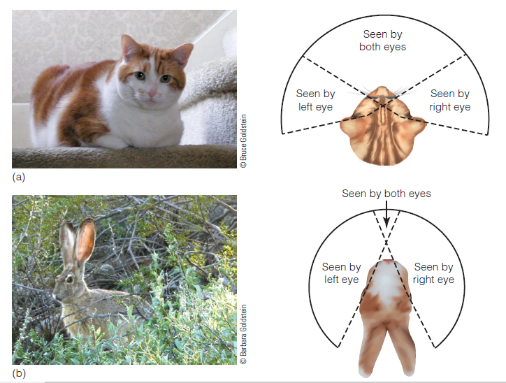

???

Figure 10.49 (a) Frontal eyes, such as those of the cat, have overlapping fields of view that provide good stereoscopic depth perception. (b) Lateral eyes, such as those of the rabbit, provide a panoramic view but poorer stereoscopic depth perception.


---

# Depth Perception Across Species
- Locusts use motion parallax to judge distance.
- Bats use echolocation to judge the distance of objects in the dark.
    - They emit sounds and note the interval between when they send them and when they receive the echo.

---

# Depth Perception Across Species


???

Figure 10.50 When a bat sends out its pulses, it receives echoes from a number of objects in the environment. This figure shows the echoes received by the bat from (a) a nearby moth; (b) a tree located about 2 meters away; and (c) a house, located about 4 meters away. The echoes from more distant objects take longer to return. The bat locates the positions of objects in the environment by sensing how long it takes the echoes to return.

---

# Infant Depth Perception
- Binocular disparity becomes functional early.
    - Binocular disparity: binocularly fixate
- Pictorial depth cues become functional later.
- Depth from familiar size
- Depth from cast shadows

