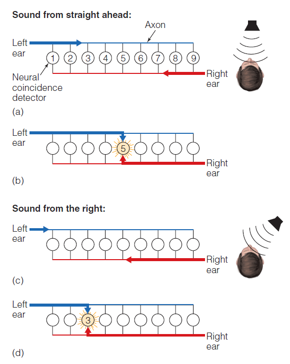
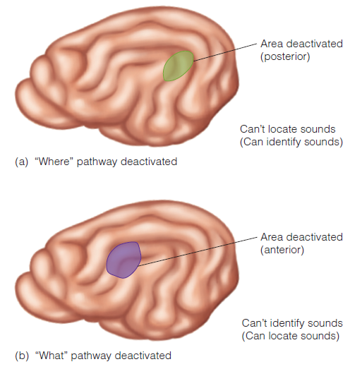
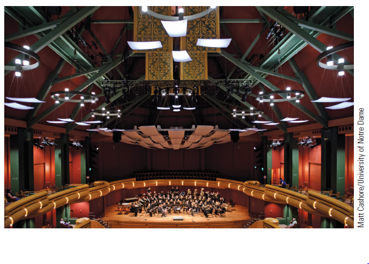

class: inverse, center, middle

```{r setup, include=FALSE}
options(htmltools.dir.version = FALSE)
```

# Auditory Localization

### Identify the different coordinates of auditory space and where auditory localization is most accurate.
### Recognize the two major binaural location cues and how effective they are for different frequencies.
### Explain why ambiguity exists when judging location of sounds.


---

# Comparing Location Information for Vision and Hearing


???

Figure 12.1 Comparing location information for vision and hearing. Vision: The bird and the cat, which are located at different places, are imaged on different places on the retina. Hearing: The frequencies in the sounds from the bird and cat are spread out over the cochlea, with no regard to the animals’ locations. 

---

# Auditory Localization
.pull-left[
- **Auditory space**: surrounds an observer and exists wherever there is sound
- Researchers study how sounds are localized in space by using:
    - *Azimuth* coordinates: position left to right
    - *Elevation* coordinates: position up and down
    - *Distance* coordinates: position from observer
]
.pull-right[


]

???

Figure 12.2 The three directions used for studying sound localization: azimuth (left–right), elevation (up–down), and distance

---

# Auditory Localization


???

The data are shown as spherical map projections, with my head at the centre of the sphere, and the interaural cue values shown by the color codes for the corresponding sound source directions in azimuth and elevation. A and B show interaural level differences (ILDs) in decibel. As you can see, ILDs are highly frequency dependent, i.e. high frequencies (say near 11 kHz, panel B) can generate large ILDs of 30 dB or larger, while lower frequencies (say near 700 Hz, panel A) generate ILDs of well below 10 dB. 

ILDs are also significantly affected by the geometry of the head, outer ears, and shoulders, which is why the patterns of the ILDs are much more irregular than the Interaural time difference (ITD) patterns shown in C. ITDs are nearly spherically symmetric around the interaural axis, are much less frequency dependent, are maximal for positions right off to one side of the head, and never exceed values of 700 microseconds or so.

ITDs and ILDs are both valuable cues for localizing sound sources, but even individuals who are deaf in one ear can sometimes localize sounds in space with some degree of accuracy. These judgements are thought to be based on monaural spectral cues (shown in D for sound source locations right in front, 0 degrees azimuth, at various elevation). Spectral cues arise because the outer ear filters sounds in a manner that depends on the angle of incidence of the sound waves, creating patterns of peaks and notches in the high frequency end of the sound.

---

# Auditory Localization
- On average, people can localize sounds:
    - Directly in front of them most accurately
    - To the sides and behind their heads least accurately
- **Location cues** not contained in the receptor cells .bolder[*like on the retina in vision*]; </br> thus, location for sounds .bolder[*must be calculated*].

---

# Binaural Cues for Sound Localization
.pull-left[
- **Binaural cues**: location cues based on the comparison of the signals are received by the left and right ears.
    - **Interaural time difference (ITD)**: difference between the times that sounds reach the two ears
        - When distance to each ear is the same, there are no differences in time.
        - When the source is to the side of the observer, the times will differ.

http://auditoryneuroscience.org/taxonomy/term/2/0?page=1

]
.pull-right[

]
???

Figure 12.4 The principle behind interaural time difference (ITD). The tone directly in front of the listener, at A, reaches the left and right ears at the same time. However, when the tone is moved to the side, at B, it reaches the listener’s right ear before it reaches the left ear. 


---

# Binaural Cues for Sound Localization
.pull-left[
- **Interaural level difference (ILD)**: difference in sound pressure level reaching the two ear
    - Reduction in intensity occurs for high frequency sounds for the far ear.
        - The head casts an acoustic shadow.
        - This effect does not occur for low frequency sounds.
- Cone of confusion
]
.pull-right[

]

???

Figure 12.3 Why interaural level difference (ILD) occurs for high frequencies but not for low frequencies. (a) Person listening to a high-frequency sound; (b) person listening to a low-frequency sound. (c) When the spacing between waves is smaller than the size of the object, illustrated here by water ripples that are smaller than the boat, the waves are stopped by the object. This occurs for the high-frequency sound waves in (a) and causes the sound intensity to be lower on the far side of the listener’s head. (d) When the spacing between waves is larger than the size of the object, as occurs for the water ripples and the narrow stalks of the cattails, the object does not interfere with the waves. This occurs for the low-frequency sound waves in (b), so the sound intensity on the far side of the head is not affected.


---

# Monaural Cue for Localization
- **Monaural cue**: uses information from one ear
    - The pinna and head affect the intensities of frequencies.
- Measurements have been performed by placing small microphones in ears & comparing intensities of frequencies with those at sound source.
    - **Spectral cue**: location information from frequency spectrum


???

Figure 12.6 (a) Pinna showing sound bouncing around in nooks and crannies. (b) Frequency spectra recorded by a small microphone inside the listener’s right ear for the same broadband sound coming from two different locations. The difference in the pattern when the sound is 15 degrees above the head (blue curve) and 15 degrees below the head (red curve) is caused by the way different frequencies bounce around within the pinna when entering it from different angles. 

---
class: inverse, center, middle

# The Physiology of Auditory Localization

### Identify the structures in the auditory pathway and the auditory areas in the cortex.
### Discuss the physiological aspects of sound localization, including findings from different species.
### Differentiate between the auditory what and where pathways along with evidence supporting this distinction.


---

# The Physiology of Auditory Localization
- Jeffress Neural Coincidence Model
    - Neurons are wired so they each receive signals from the two ears.
    - Coincidence detectors
    - ITD detectors
    - ITD tuning curves


???
- Jeffress: standings time
- Coincidence detectors: neuron model(J): if simultaneous event in both ears then coincidence (generalized to Interaural Time Diff Det)
- ITD detectors: Jeffress model each neuron responds to specific time delay (like retinal disp neurons)
- ITD tuning curves: plot of det. neuron f.r. on x axis of ITD

---

# The Physiology of Auditory Localization
.pull-left[

]


.pull-right[

]

--


???

Figure 12.8 How the circuit proposed by Jeffress operates. 
- Axons transmit signals:
    - left ear (blue) 
    - right ear (red) 
    - to neurons (circles). 
-  Sound in front. 
    - (a)Signals start in left and right channels simultaneously. 
    - (b) Signals meet at neuron 5, causing it to fire. 
- Sound to the right. 
    - (c) Signal starts in the right channel first. 
    - (d) Signals meet at neuron 3, causing it to fire


---

# Cortical Mechanisms of Location
.pull-left[
- Area A1 is involved in locating sound.
    - Neff's research on cats
- Posterior belt area is involved in locating sound.
    - Recanzone's research on monkey neurons
- Anterior belt is involved in perceiving sound.
]
.pull-right[


]

???

Figure 12.12 Monkey ctx Aud pathways
- Part of area A1 is visible. 
    - core, belt, and parabelt areas are not visible because they are hidden within the fold of the temporal lobe. 
- The pathways shown here connect to the anterior and posterior belt areas. 
- A:anterior; P:posterior; green=auditory what pathway; red = auditory where pathway. 


---

# Cortical Mechanisms of Location


???


---

# Cortical Mechanisms of Location



???

Figure 12.13 Results of Lomber and Malhotra’s (2008) experiment. (a) When the posterior (where) auditory area was deactivated by presenting a cooling probe within the green area, the cat could not locate sounds but could identify sounds. (b) When the anterior (what) auditory area of the cat was deactivated by presenting a small cooling probe within the purple area, the cat could not identify sounds but could locate sounds.


---

# Cortical Mechanisms of Location


???


---

# What and Where Auditory Pathways
.pull-left[
- What, or ventral stream, starts in the anterior portion of the core and belt and extends to the prefrontal cortex-used to identify sounds.
- Where, or dorsal stream, starts in the posterior core and belt and extends to the parietal and prefrontal cortices-used to locate sounds.
- Evidence from neural recordings, brain damage, and brain scanning support these findings.
]
.pull-right[

]
---
class: inverse, center, middle

# Hearing Inside Rooms

### Explain what the precedence effect is and describe how the effect can be demonstrated.


---

# Hearing Inside Rooms
.pull-left[
- **Direct sound**: sound that reaches the listener's ears straight from the source
- **Indirect sound**: sound that is reflected off of environmental surfaces and then to the listener
- When a listener is outside, most sound is direct; however inside a building, there is direct and indirect sound.
]
.pull-right[

]

???

Figure 12.14 (a) When you hear a sound outdoors, sound is radiated in all directions, indicated by the blue arrows, but you hear mainly direct sound, indicated by the red arrow. (b) When you hear a sound inside a room, you hear both direct sound (1) and indirect sound (2, 3, and 4) that is reflected from the walls, floor, and ceiling of the room. 


---

# Architectural Acoustics
- The study of how sounds are reflected in rooms
- Factor that affects perception in concert halls
    - **Reverberation time**: time when sound decreases 1/1000th original pressure
        - If it is too long, sounds are "muddled."
        - If it is too short, sounds are "dead."
        - Ideal times are around two seconds.




???

Figure 12.16 Leighton Concert Hall in the DeBartolo Performing Arts Center at the University of Notre Dame. Reverberation time can be adjusted by changing the position of the panels and banners on the ceiling and draperies on the sides

---

# Architectural Acoustics
- Other factors that affect perception  
    - **Intimacy time**: time between source origin and when 1st reflection arrives
        - Best time is around 20 ms.
    - **Bass ratio**: ratio of low to middle frequencies reflected from surfaces
        - High bass ratios are best.
    - **Spaciousness factor**: fraction of all the sound received by listener that is indirect
        - High spaciousness factors are best.


---

# The Auditory Scene: Separating Sound Sources
.pull-left[
- **Auditory scene**: the array of all sound sources in the environment
- **Auditory scene analysis**: process by which sound sources in the auditory scene are separated into individual perceptions.
    - Does not happen at the cochlea since simultaneous sounds are together in the pattern of vibration of the basilar membrane
]
.pull-right[

]
???

Figure 12.17 Each musician produces a sound stimulus, but these signals are combined into one signal, which enters the ear. 

---

# The Auditory Scene: Separating Sound Sources
- Heuristics that help to perceptually organize stimuli
    - **Onset time**: sounds that start at different times are likely to come from different sources.
    - **Location**: a single sound source tends to come from one location and to move continuously. 
    - **Similarity of timbre and pitch**: similar sounds are grouped together. 

