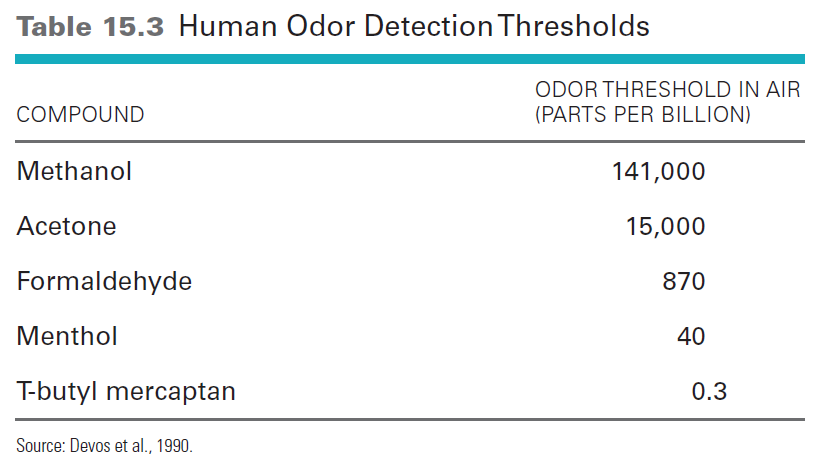
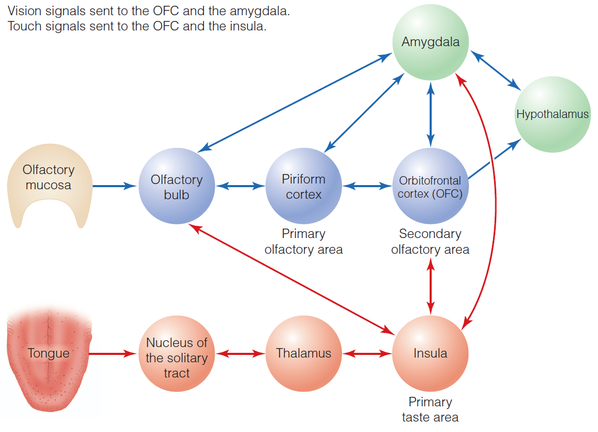

class: inverse, center, middle
---
title: "Chapter 15: Chemical Senses"
subtitle: "📕🔬📓 "
author: "Sensory Processes EXP3104"
date: "December 4, 2017"
output:
  xaringan::moon_reader:
    lib_dir: libs
    css: ["libs/remark-css/picnic_sq_plate.css", "libs/remark-css/text-fx.css"]
    nature:
      highlightStyle: github
      highlightLines: true
      countIncrementalSlides: false
---
class: inverse, center, middle

.round-plate[
.round-plate-inner[
 
## Taste Quality
## Olfaction 
## The Perception of Flavor
]
]

---
class: inverse, center, middle

.round-plate[
.round-plate-inner[
 
# Taste Quality
#### Identify functions of taste, identify   taste qualities, & structures   and functions of taste system.
]
]

---

## The Function of Chemical Senses
- "Gatekeepers" of the body: 
    - Identify things that should be consumed for survival
    - Detect things that would be harmful and should be rejected
    - Cause good and bad affective responses

---

## Basic Taste Qualities
.pull-left[
- Five basic taste qualities
    - Salty
    - Sour
    - Sweet
    - Bitter
    - Umami: described as meaty, brothy or savory, and associated with MSG
]
.pull-right[

]

???

Figure 15.1 The contribution of each of the four basic tastes to the tastes of KCl and NaNO3, determined by the method of magnitude estimation. The height of the line indicates the size of the magnitude estimate for each basic taste. 

---

### Connections Between Taste Quality & a Substance's Effect
.pull-left[
- Sweetness is usually associated with substances that have nutritive value.
- Bitter is usually associated with substances that are potentially harmful.
- Salty taste indicates the presence of sodium.
- However, there is not a perfect connection between tastes and function of substances.
]
.pull-right[

]

---

## Structure of the Taste System

.pull-left[
- Tongue contains papillae
    - Filiform: shaped like cones and located over entire surface
    - Fungiform: shaped like mushrooms and found on sides and tip
    - Foliate: series of folds on back and sides
    - Circumvilliate: shaped like flat mounds in a trench located at back
]
.pull-right[

]

???

Figure 15.2 (a) The tongue, showing the four different types of papillae. (b) A fungiform papilla on the tongue; each papilla contains a number of taste buds. (c) Cross section of a taste bud showing the taste pore where the taste stimulus enters. (d) The taste cell; the tip of the taste cell is positioned just under the pore. (e) Close-up of the membrane at the tip of the taste cell, showing the receptor sites for bitter, sweet, sour, and salty substances. Stimulation of these receptor sites, as described in the text, triggers a number of different reactions within the cell (not shown) that lead to movement of charged molecules across the membrane, which creates an electrical signal in the receptor.

---

## Structure of the Taste System

???

---

## Structure of the Taste System
.pull-left[
- Taste buds are located in papillae except for filiform.
    - Tongue contains approximately 10,000 taste buds.
    - Each taste bud has 50-100 taste cells with tips that extend into the taste pore.
    - Transduction occurs when chemicals contact the receptor sites on the tips.
]
.pull-right[

]

???

Figure 15.3 The surface of the tongue. The red dots are fungiform papillae. 

---

## Structure of the Taste System

.pull-left[

]
.pull-right[
- Signals from taste cells travel along a set of pathways.
    - Chorda tympani nerve from front and sides of tongue
    - Glossopharyngeal nerve from back of tongue
    - Vagus nerve from mouth and throat
    - Superficial petronasal nerve from soft palate
]
???

Figure 15.4 The central pathway for taste signals, showing the nucleus of the solitary tract, where nerve fibers from the tongue and the mouth synapse in the medulla at the base of the brain. From the nucleus of the solitary tract, these fibers synapse in the thalamus and then the insula and frontal operculum, which are the cortical areas for taste. 

---

## Structure of the Taste System
.pull-left[

]
.pull-right[
- These pathways make connections in the nucleus of the solitary tract in the spinal cord.
- Then, they travel to the thalamus.
    - Followed by areas in the frontal lobe:
- Insula
- Frontal opervulum cortex
- Orbital frontal cortex

https://youtu.be/olrarFTzBRo
]

---
class: inverse, center, middle

.round-plate[
.round-plate-inner[
 
# The Neural Code for Taste Quality
#### Critique the evidence for specificity vs. distributed coding in taste.
]
]

---

## Population Coding

.pull-left[
- Experiment by Erickson
    - Different taste stimuli were presented to rats, and recordings were made from the chorda tympani.
    - Across-fiber patterns showed that two substances (ammonium chloride and potassium chloride) are similar to each other but different from sodium chloride.
]
.pull-right[

]

???

Figure 15.5 Across-fiber patterns of the response of fibers in the rat’s chorda tympani nerve to three salts. each letter on the horizontal axis indicates a different single fiber. 

---

## Specificity Coding
- Experiment by Mueller et al.
    - Genetic cloning was used to determine if mice could be created that possessed a human receptor that responds to PTC.
    - Normally, mice don't have this receptor or respond to this substance.
    - Experiment was successful, but not all data show same results.

???

---

## Specificity Coding
.pull-left[
- Applying amiloride to the tongue blocks flow of sodium to taste receptors.
    - Causes decrease in the responding of neurons in rat's brainstem that respond to salt, but not to those that respond to salty and bitter.
]
.pull-right[

]

???

Figure 15.8 The blue dashed lines show how two neurons in the rat’s nucleus of the solitary tract respond to a number of different taste stimuli (along the horizontal axis). The neuron in (a) responds strongly to compounds associated with salty tastes. The neuron in (b) responds to a wide range of compounds. The purple lines show how these two neurons fire after the sodium-blocker amiloride is applied to the tongue. This compound inhibits the responses of the neuron that responds to salt (a) but has little effect on neuron (b).

---

## Specificity Coding
- Evidence exists for both specificity and population coding but balance is shifting toward specificity.
- Some researchers suggest that the neural system for taste may function like the visual system for color (e.g., Trichromatic Theory).
- Currently, there is no agreed upon explanation for the neural system for taste.

---

## Individual Differences in Taste
- There are different responses to phenylthiocarbamide (PTC) and to 6-n-propylthiouracil (PROP):
    - Tasters, nontasters, and supertasters
    - Tasters have more taste buds than nontasters.
    - Tasters have specialized receptors for these compounds.
    - Supertasters appear more sensitive to bitter substances than tasters.

---
class: inverse, center, middle

.round-plate[
.round-plate-inner[
# Olfaction & Flavor
## The Functions of Olfaction
#### Describe how anosmia demonstrates the importance of olfaction, and how odor detection thresholds are measured.

]
]

---

## The Functions of Olfaction
- Many animals are macrosmatic: having a keen sense of smell that is necessary for survival  
- Humans are microsmatic: a less keen sense of smell that is not crucial to survival
- Singh and Bronstad: showed a relationship between men's rating of women's body odors and the women's menstrual cycle

---

## Detecting Odors
- Measuring the detection threshold
    - Yes/no procedure: participants are given trials with odors along with "blank" trials.
- They respond by saying yes or no.
- This can result in bias in terms of when the participant decides to respond.
    - Forced-choice: two trials are given, one with odorant and one without.
- Participant indicates which smells strongest.

???

Forced-choice: strongest/greater smell

---

## Detecting Odors
- Rats are 8 to 50 times more sensitive to odors than humans. 
- Dogs are 300 to 10,000 times more sensitive.
- However, individual receptors for all of these animals are equally sensitive.
- The difference lies in the number of receptors they each have.
    - Humans have ten million and dogs have one billion olfactory receptors.

---

## Detecting Odors

???

---
class: inverse, center, middle

.round-plate[
.round-plate-inner[

# Analyzing Odorants:  Mucosa & Olfactory Bulb
#### Identify the structures and functions of the olfactory system.
#### Discuss how recognition profiles affect receptors.

]
]

---

## Identifying Odors
- Humans can discriminate more than one trillion different odors.
    - Find it difficult to identify odors
    - Only successful half of the time

---

## The Puzzle of Olfactory Quality
.pull-left[
- Researchers have found it difficult to map perceptual experience onto physical attributes of odorants.
    - There is no specific language for odor quality.
    - Some molecules that have similar structure smell different, and some that have different structures smell the same.
- Links have been found between the structure of molecules, olfactory quality, and patterns of activation in the olfactory system.
]
.pull-right[

]

???

Figure 15.10 (a) Two molecules that have the same structure, but one smells like musk and the other is odorless. (b) Two molecules with different structures but similar odors.

---

## The Puzzle of Olfactory Quality

???

Figure 15.11 Hundreds of molecules from the coffee, orange juice, and bacon are mixed together in the air, but the person just perceives “coffee,” “orange juice,” and “bacon.” This perception of three odor objects from hundreds of intermixed molecules is a feat of perceptual organization.

---

## The Olfactory Mucosa
.pull-left[
- Olfactory mucosa is located at the top of the nasal cavity.
    - Odorants are carried along the mucosa coming in contact with the olfactory receptor neurons (ORN).
    - These neurons contain molecules called olfactory receptors.
    - Humans have about 350 types of receptors.
]
.pull-right[

]
???

Figure 15.12 The structure of initial structures in the olfactory system. 
- (a) Odorant molecules enter the nose, and then 
- (b) flow over the olfactory mucosa, which contains 350 different types of olfactory receptor neurons (OrNs). 
- (c) Stimulation of receptors in the OrNs 
- (d) activates the OrNs. Three types of OrNs are shown here, indicated by different colors. each type has its own specialized receptors. 
- (e) Signals from the OrNs are then sent to glomeruli in the olfactory bulb, 
- and then (f) to higher cortical areas. 

---

## How Olfactory Receptor Neurons Respond to Odorants
.pull-left[

]
.pull-right[

]
???

Figure 15.13 (a) A portion of the olfactory mucosa. The mucosa contains 400 types of OrNs and about 10,000 of each type. The red circles represent 10,000 of one type of OrN, and the blue circles, 10,000 of another type. (b) All OrNs of a particular type send their signals to one or two glomeruli in the olfactory bulb.

---

## How Olfactory Receptor Neurons Respond to Odorants

???

Figure 15.14 recognition profiles for some odorants. large dots indicate that the odorant causes a high firing rate for the receptor listed along the top; a small dot indicates a lower firing rate for the receptor. The structures of the compounds are shown on the right. 

---

## The Search for Order in the Olfactory Bulb
- Signals are carried to the glomeruli in the olfactory bulb.
    - ORNs of a particular type send their signals to one or two glomeruli.
- Two techniques have been used to determine how the glomeruli respond to different odorants.
    - Optical imaging method
    - 2-deoxyglucose (2DG) technique

???

Figure 15.15 Areas in the rat olfactory bulb that are activated by various chemicals: (a) a series of carbolic acids; (b) a series of aliphatic alcohols. 

---

## The Search for Order in the Olfactory Bulb

???
- ORNs match particular glomeruli
- separation inhibition (like opposing-color theory early vision)

---
class: inverse, center, middle

.round-plate[
.round-plate-inner[

# Cortex & Odors
#### Outline how odorants are represented in  Piriform Cortex & the process by which   odor objects come to be represented in Piriform Cortex.
]
]

---

## Representing Odors in the Cortex
- Signals from the olfactory bulb are sent to: 
    - Primary olfactory (piriform) cortex in the temporal lobe and amygdala
- Amygdala plays a role in emotional reactions to odors.
    - Then to secondary olfactory (orbitofrontal) cortex in the frontal lobe

???

Figure 15.17 (a) The underside of the brain, showing the neural pathways for olfaction. On the left side, the temporal lobe has been deflected to expose the olfactory area. (b) Flow diagram of the pathways for olfaction. 

---

## How Odor Objects Are Represented
- Experiment by Wilson
    - Measured response of neurons in the rat's piriform cortex to two odorants
- A mixture: isoamyl acetate and peppermint
- A compound: isoamyl acetate alone
    - Results showed that with enough exposure, the piriform cortex could discriminate between the mixture and the compound.

???

- isoamyl acetate (banana)
- Figure 15.21 Memory mechanism for forming representations of the flower’s odor.
    - 1 sniff
    - several dz.
    - 10-100 sniffs 

---
class: inverse, center, middle

.round-plate[
.round-plate-inner[
#  Flavor Perception
#### Discuss how elimination of   olfaction affects “tasting”.
#### Describe the physiology of flavor & how   expectations and satiety affect flavor.
#### Summarize the Proust effect.
]
]

---

## The Perception of Flavor
.pull-left[
- Combination of smell, taste, and other sensations (such as burning of hot peppers)
- Odor stimuli from food in the mouth reaches the olfactory mucosa through the retronasal route.
- The taste of most compounds is influenced by olfaction, but a few, such as MSG are not.
]
.pull-right[

]

???

Figure 15.22 Odorant molecules released by food in the oral cavity and pharynx can travel through the nasal pharynx (dashed arrow) to the olfactory mucosa in the nasal cavity. This is the retronasal route to the olfactory receptors.

---

## The Perception of Flavor

???

Figure 15.23 How people described the flavors of three different compounds when they tasted them with their nostrils clamped shut and with their nostrils open. each X represents the judgment of one person. 

---

## Taste and Olfaction Meet in the Nervous System
- Responses from taste and smell are first combined in the orbital frontal cortex (OFC).
- Interactions between taste, olfaction, vision and touch underscore multimodal nature of our experience of flavor.
- What are bimodal neurons?

---

## Taste and Olfaction Meet in the Nervous System

???

Figure 15.24 Flavor is created by interactions among taste, olfaction, vision, and touch. The olfactory pathway (blue) and taste pathway (red) interact as signals are sent between these two pathways. in addition, both taste and olfactory pathways send signals to the orbitofrontal cortex (OFC), signals from touch are sent to the taste pathway and the OFC, and signals from vision are sent to the OFC. Also shown are the amygdala—which is responsible for emotional responses and has many connections to structures in both the taste and olfaction pathways and also receives signals from vision—and the hypothalamus, which is involved in determining hunger. 

---

## Flavor Is Influenced by Cognitive Factors
.pull-left[
- Plassmann experiment
    - Judging taste pleasantness of wine
- The higher the price of the wine label, the more pleasant the rating
]
.pull-right[

]

???

Figure 15.25 Effect of expectation on flavor perception, as indicated by the results of Hilke Plassmann and coworkers’ (2008) experiment. (a) The red and blue bars indicate ratings given to two presentations of the same wine (although subjects didn’t know they were the same). The two bars on the left indicate ratings when there were no price labels on the wines. The two bars on the right indicate that the subjects gave higher “taste pleasantness” ratings when the wine was labeled $90, compared to when it was labeled $10. (b) responses of the OFC when tasting the wines labeled $10 and $90. 

---

### Sensory-Specific Satiety: Effect of Food Intake on Flavor
.pull-left[
- O'Doherty experiment
    - Both the pleasantness of a food-related odor and the brain's response to an odor can be influenced by satiety.

]
.pull-right[

]

???

Figure 15.26 Sensory-specific satiety. Results of the O’Doherty et al. (2000) experiment. 
- (a) pleasantness rating for banana and vanilla odor before eating (left bars) and after eating bananas to satiety (right bars). 
- (b) response of the orbitofrontal cortex to banana and vanilla odors before and after eating bananas. 
https://thejacksonstakethailand.wordpress.com/2014/12/14/lopburi-monkey-festival/

---
background-image: url(ego.jpg)
background-size: 100%
background-position: 110% 80%

## The Proust Effect: Memories, Emotions, and Smell
- Smell can induce memory recall.
    - Proust effect: the ability of taste and olfaction to unlock memories 
    - https://youtu.be/uXPlzdTcA-I

