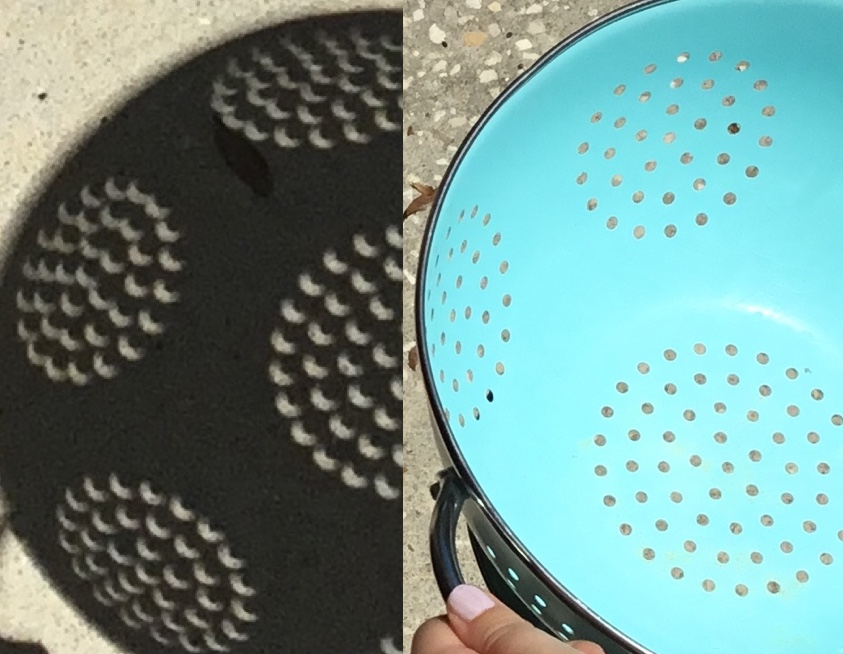

class: inverse, center, middle, clear

```{r setup, include=FALSE}
options(htmltools.dir.version = FALSE)
```

# The Beginning of the Perceptual Process

![:hline]

### Describe how the cornea & lens focus images on the retina.

---

# Starting at the Beginning


???

Figure 2.1 Chapter preview. This chapter will describe the first three steps of the perceptual process for vision and will introduce Step 4. Physical processes are indicated in black; the perceptual outcomes of these processes are indicated in blue.

---
class: inverse, center, middle

# Light, the Eye, and the Visual Receptors 

![:hline]

### Discuss the differences between the  <br/> distribution of the rods and the cones.
### Explain why the “blind spot” exists,  <br/>  and why we are not usually aware of it.


---

# The Eye


???

Figure 2.2 An image of the tree is focused on the retina, which lines the back of the eye. The close-up of  the retina on the right shows the receptors and other neurons that make up the retina. 


---
class: inverse
background-image: url(Sam2.jpg)
background-size: 115%

# .font60[Perceptual Process Step 2 : Principle of transformation]


---

# Steps 1 and 2 of the Perceptual Process
- Principle of transformation
    - When the stimuli and responses created by stimuli are transformed, or changed, between the environmental stimuli and perception.

.pull-left[

]


--

.pull-left[

]


---

# Steps 1 and 2 of the Perceptual Process
- Principle of transformation
    - When the stimuli and responses created by stimuli are transformed, or changed, between the environmental stimuli and perception.




---
class: inverse
background-image: url(road-2017.JPG)
background-size: 115%

# .font60[Perceptual Process Step 2 : Principle of transformation]


---
# .font60[Perceptual Process Step 2 : Principle of transformation]


---

# .font60[How does the visual field "map" onto the retina?]


--


--


--


???
- Imagine standing outside a kitchen from about 10 feet. Peer though a cat door into the kitchen.
   - What can you see?
- Imagine peering through a keyhole from 10 feet away:
   - What can you see?
   - Can a laser pointer shine into the kitchen?
   - Where in the kitchen?
- Why does everything reverse?


---


# The Eye 

.left-column[
Light enters through pupil and is focused by cornea & lens to a sharp image on retina.
]


---


# The Eye 

.left-column[
- Rods & cones: visual receptors in retina 
that contain visual pigment
- The optic nerve carries information from the retina toward the brain.
]


---


# The Eye 

Differences between rods and cones

- Shape
    - **Rods**: large and cylindrical
    - **Cones**: small and tapered
- Distribution on retina
    - Fovea consists solely of cones.
    - Peripheral retina has both rods and cones.
    - More rods than cones in periphery.


---


# .font70[Relation of Parts of Retina to Loss of Visual Field?]


.pull-left[
- **Macular degeneration**
    - **Fovea** & small surrounding area are destroyed
    - Creates new “blind spot” on retina in *center* of field
    - Most common in older individuals
]
.pull-right[
- **Retinitis pigmentosa**
    - Genetic disease
    - **Rods** destroyed first in *periphery*
    - Foveal cones eventually attacked
    - Severe cases: complete blindness
]

???


---


# The Eye 
.pull-left[
- Number: about 120 million rods and 6 million cones
- **Blind spot**: place where optic nerve leaves the eye
]
--
.pull-right[
- We don’t see it because:
    - Eyes cover each other's blind spot
    - Located at edge of the visual field
    - The brain “fills in” the spot
]

--


???

Figure 2.8 View the pattern as described in the text, and observe what happens when the center of the wheel falls on your blind spot


---
class: clear
.pull-left[

]
.pull-right[

- Blindspot
    - located 12-15 degrees (eccentricity); 
    - 5.5 x 7.5 deg. (width x height); 
    - slightly below horizontal (1.5 deg.)

]
.pull-left[

]

---

# Links from Today's Discussion

**Blindspot**
  
[isle.hanover.edu/isle2/](https://isle.hanover.edu/isle2/)

- (Unfortunately, we don't have time to do this today, but please try this activity at home if you are not able to find your blindspot by other means.)
- ISLE 3.5. Map Your Blind Spot


---
class: inverse, center, middle

# Focusing Light Onto the Receptors

![:hline]

### Describe how the cornea and lens focus the image on the retina.


---

# Focusing Light Onto the Receptors

.pull-left[
- The **cornea** is fixed, unchanging
    - accounts for 80% focusing.
- The **lens** 
    - adjusts shape for object distance
    - accounts for  other 20%.
- **Accommodation** results when ciliary muscles are tightened which causes the *lens to thicken*.
    - Light rays pass through the lens more sharply and focus **near** objects on retina.
]


???

- Figure 2.9 Focusing of light rays by the eye. 
    - (a) Rays of light coming from a small light source that is more than 20 feet away are approximately parallel. The focus point for parallel light is at A on the retina. 
    - (b) Moving an object closer to the relaxed eye pushes the focus point back. Here the focus point is at B, but light is stopped by the back of the eye, so the image on the retina is out of focus. 
    - (c) Accommodation of the eye (indicated by the fatter lens) increases the focusing power of the lens and brings the focus point for a near object back to A on the retina, so it is in focus. This accommodation is caused by the action of the ciliary muscles, which are not shown. 
    - (d) In the myopic (nearsighted) eye, parallel rays from a distant spot of light are brought to a focus in front of the retina, so distant objects appear blurred. 
    - (e) A corrective lens bends light so it is focused on the retina.


---

# Focusing Light Onto the Receptors 

.pull-left[
- The near point is closest focal point where the lens can accomodate. (Any closer, not so much...![:emoji confused])
- **Presbyopia**: “old eye”
    - Distance of near point increases.
    - Due to hardening of lens and weakening of ciliary muscles
    - Corrective lenses are needed for close activities, such as reading.
]


---


# Focusing Light Onto the Receptors 

.pull-left[
- **Myopia** or nearsightedness: inability to see distant objects clearly
- Image is focused in front of retina.
- Caused by:
    - *Refractive* myopia: cornea or lens bends too much light.
    - *Axial* myopia: eyeball is too long.
]

--


.pull-right[

]

???

Figure 2.9 In the myopic (nearsighted) eye, parallel rays from a distant spot of light are brought to a focus in front of the retina, so distant objects appear blurred.


---


# Focusing Light Onto the Receptors 
- **Hyperopia** or farsightedness: inability to see nearby objects clearly
    - Focus point is **behind** the retina.
    - Usually caused by an eyeball that is too **short**
    - Constant accommodation for nearby objects can lead to *eyestrain and headaches*.

---

---

# Links for Today's Discussion


**Lens Optics**
  
[isle.hanover.edu/isle2/](https://isle.hanover.edu/isle2/)
- ISLE 3.2. Accommodation
- ISLE 3.3. Presbyopia
- ISLE 3.13. Correcting Myopia and Hyperopia


???

Go to Canvas to find questions for today


---
class: inverse, center, middle

# Receptors and Perception

![:hline]

### Describe the role of visual pigments in transduction.
### Describe the method for measuring dark adaptation, <br/> and the overall results.

---


# Light: The Stimulus for Vision

- Electromagnetic spectrum
    - Energy is described by wavelength.
    - Spectrum: from short wavelength gamma rays to long wavelength radio waves.
    - Visible spectrum for humans ranges from 400 to 700 nanometers.
    - Most perceived light is reflected light.
    


---

# .font70[Transforming Light Energy Into Electrical Energy]
Receptors have outer segments, which contain:
- Visual pigment molecules (two components):
    - **Opsin**,  a large protein
    - **Retinal**, a light sensitive molecule
- Visual transduction: retinal absorbs photon.
    - **Isomerization**: retinal changes its shape


---


# .font70[Transforming Light Energy Into Electrical Energy]


.pull-left[
Isomerization triggers an enzyme cascade.
- Enzymes facilitate chemical reactions.
- **Cascade** reaction: single reaction leads to increasing numbers of chemical reactions.
- Isomerizing one pigment leads to the activation of a rod receptor.

]
.pull-right[

]


???

Figure 2.10 Model of a visual pigment molecule. The horizontal part of the model shows a tiny portion of the huge opsin molecule near where the retinal is attached. The smaller molecule on top of the opsin is the light-sensitive retinal. (a) The retinal molecule’s shape before it absorbs light. (b) The retinal molecule’s shape after it absorbs light. This change in shape, which is called isomerization, triggers a sequence of reactions that culminates in generation of an electrical response in the receptor.


---


# Adapting to the Dark

.pull-left[
- Dark adaption is the process of increasing sensitivity in the dark.
    - Measured by determining a dark adaptation curve
]
.pull-right[

]

???

Figure 2.12 Viewing conditions for a dark adaptation experiment.  In this example, the image of the fixation point falls on the fovea, and the image of the test light falls on the **peripheral retina**


---


# Visual Pigment Regeneration

.pull-left[
- Process needed for transduction:
    - Retinal molecule changes shape.
    - Opsin molecule separates.
    - The retina shows visual pigment bleaching.
    - Retinal and opsin must recombine to respond to light.
    - Visual pigment regenerates.
]


.pull-right[

]

???

Figure 2.14 A frog retina was dissected from the eye in the dark and then exposed to light. The top row shows how the relationship between retinal and opsin changes after the retinal absorbs light. Only a small part of the opsin molecule is shown. The photographs in the bottom row show how the color of the retina changes after it is exposed to light. (a) This picture of the retina was taken just after the light was turned on. The dark red color is caused by the high concentration of visual pigment in the receptors that are still in the unbleached state. (b, c) After the retinal isomerizes, the retinal and opsin break apart, and the retina becomes bleached, as indicated by the lighter color.

---

# Spectral Sensitivity 

.pull-left[


]

.pull-right[

- Sensitivity of rods and cones to different parts of the visual spectrum
    - Use **monochromatic** light to determine threshold at (many) different wavelengths.
    - Threshold for light is lowest in the middle of the spectrum.
    - 1/threshold = sensitivity, which produces the spectral sensitivity curve.

]
???

- Figure 2.15 
    - (a) The threshold for seeing a light as a function of wavelength.
    - (b) **Relative** sensitivity as a function of wavelength—the spectral sensitivity curve. 

---


# Spectral Sensitivity 

.pull-left[
- Rod spectral sensitivity (scotopic)
    - More sensitive to short-wavelength light
    - Most sensitivity at 500 nm
- Cone spectral sensitivity (photopic)
    - Most sensitivity at 560 nm
- Purkinje shift: enhanced sensitivity to short wavelengths during dark adaptation when the shift from cone to rod vision occurs
]

.pull-right[

]

???

- Figure 2.16 Spectral sensitivity curves for rod vision (left) and cone vision (right). 
- The maximum sensitivities of these two curves have been set equal to 1.0. 
- However, the relative sensitivities of the rods and the cones depend on the conditions of adaptation: 
    - The cones are more sensitive in the light, and 
    - the rods are more sensitive in the dark. 
- **circles**: rod curve are the absorption spectrum of the rod visual pigment. (intervals of 10)


---


# Spectral Sensitivity

.pull-left[
- Difference in spectral sensitivity is due to absorption spectra of visual pigments.
- **Rod** pigment absorbs best: 500nm.
- Cone pigments absorb best at 419nm, 531nm, & 558nm.
    - Absorption of all cones equals the peak of 560nm in the spectral sensitivity curve.
]

.pull-right[

]

???

Figure 2.18 Absorption spectra of the rod pigment (R), and the short- (S), medium- (M), and long-wavelength (L) cone pigments. 

---
class: inverse, center, middle

# Electrical Signals in Neurons

![:hline]

### Identify the key components of neurons.
### Define propagated response, and discuss <br/>  how this is related to measuring activity in a single neuron.
### Describe depolarization, hyperpolarization, and inhibition.

---

# Electrical Signals in Neurons

- Key components of neurons:
    - Cell body
    - Dendrites
    - Axon or nerve fiber
- Sensory receptors: specialized neurons that respond to specific kinds of energy


???

Figure 2.19 The neuron on the right consists of a cell body, dendrites, and an axon, or nerve fiber. The neuron on the left that receives stimuli from the environment has a receptor in place of the cell body. 

---


# Electrical Signals in Neurons 


???

Figure 2.20 Side view of the visual system showing the three major sites along the primary visual pathway: the eye, the lateral geniculate nucleus, and the visual receiving area, which is also called the striate cortex or Area V1. 


---


# Recording Electrical Signals in Neurons

.pull-left[
- Small electrodes are used to record from single neurons.
    - Recording electrode is inside the nerve fiber.
    - Reference electrode is outside the fiber.
    - Difference in charge between them is -70 mV
    - This negative charge of the neuron relative to its surroundings is the resting potential.

]
.pull-right[

]

???


---


# Recording Electrical Signals in Neurons 


???


---


# Basic Properties of Action Potentials

.pull-left[
- Action potentials:
    - Show propagated response.
    - Remain the same size regardless of stimulus intensity.
    - Increase in rate to increase in stimulus intensity.
    - Have a refractory period of 1 ms – upper firing rate is 500 to 800 impulses per second.
    - Show spontaneous activity that occurs without stimulation.

]
.pull-right[


]

https://www.youtube.com/watch?v=IhR2l3g43dw
  
https://www.youtube.com/watch?v=Cw5PKV9Rj3o

???


---


# Chemical Basis of Action Potentials 


--


???

Figure 2.25 How the flow of sodium and potassium creates the action potential. (a) When the fiber is at rest, there is no flow of ions, and the record indicates the 270 mV resting potential. (b) Ion flow occurs when an action potential travels down the fiber. Initially, positively charged sodium (Na1) flows into the axon, causing the inside of the neuron to become more positive (rising phase of the action potential). (c) Later, positively charged potassium (K1) flows out of the axon, causing the inside of the axon to become more negative (falling phase of the action potential). (d) When the action potential has passed the electrode, the charge returns to the resting level. 

---


# Transmitting Information Across a Gap

.pull-left[
- Synapse is the small space between neurons.
- Neurotransmitters are:
    - Released by the presynaptic neuron from vesicles
    - Received by the postsynaptic neuron on receptor sites
    - Matched like a key to a lock into specific receptor sites
    - Used as triggers for voltage change in the postsynaptic neuron
]
.pull-right[


]

???

2.26 Synaptic transmission from one neuron to another. (a) A signal traveling down the axon of a neuron reaches the synapse at the end of the axon. (b) The nerve impulse causes the release of neurotransmitter molecules from the synaptic vesicles of the sending neuron. (c) The neurotransmitters fit into receptor sites that are shaped like the transmitter and cause a voltage change in the receiving neuron.

---


# Transmitting Information Across a Gap 


- Excitatory transmitters cause depolarization.
    - Neuron becomes more positive.
    - Increases the likelihood of an action potential


--

- Inhibitory transmitters cause hyperpolarization.
    - Neuron becomes more negative.
    - Decreases the likelihood of an action potential


???

Figure 2.27 (a) Excitatory transmitters cause depolarization, an increased positive charge inside the neuron. (b) When the level of depolarization reaches threshold, indicated by the dashed line, an action potential is triggered. (c) Inhibitory transmitters cause hyperpolarization, an increased negative charge inside the axon. 

---
class: inverse, center, middle

# Neural Convergence and Perception

![:hline]

### Describe what convergence is, and how it related to acuity in rods and cones.

---

# Neural Convergence and Perception 

- 126 million rods and cones converge to   
    1 million ganglion cells.
- Higher convergence of rods than cones
    - ~120 rods to 1 ganglion cell
    - 6 cones to 1 ganglion cell
    - **Fovea** 1 cone to 1 ganglion cell


---

# Neural Convergence and Perception 

- 126 million rods and cones converge to   
    1 million ganglion cells.
- Higher convergence of rods than cones
    - ~120 rods to 1 ganglion cell
    - 6 cones to 1 ganglion cell
    - **Fovea** 1 cone to 1 ganglion cell


---

# Neural Convergence and Perception 

- 126 million rods and cones converge to  
    1 million ganglion cells.
- Higher convergence of rods than cones
    - ~120 rods to 1 ganglion cell
    - 6 cones to 1 ganglion cell
    - **Fovea** 1 cone to 1 ganglion cell


--


---


# Neural Convergence and Perception 


- Which way to pupil and light stimuli?

???

Figure 2.29 (a) Cross section of a monkey retina, which has been stained to show the various layers. Light is coming from the bottom. The purple circles are cell bodies of the receptors, bipolar cells, and ganglion cells.


---


# Neural Convergence and Perception

.pull-left[
- Rods and cones send signals vertically through:
    - Bipolar cells
    - Ganglion cells
    - Ganglion axons
- Signals are sent horizontally:
    - Between receptors by horizontal cells
    - Between bipolar and between ganglion cells by amacrine cells
]
.pull-right[

]

---


# .font60[Convergence Causes the Rods to Be More Sensitive Than the Cones]

.pull-left[
- **Rods**: more light sensitive than cones.
    - Rods take less light to respond.
    - Rods have greater convergence
    - Input summation of many rods into ganglion cells increases response-likelihood.
    - **Trade-off**: Rods cannot distinguish detail.
]


???
fig_2_30.png
Figure 2.30 The wiring of the rods (left) and the cones (right). The yellow dot and arrow above each receptor represents a “spot’’ of light that stimulates the receptor. The numbers represent the number of response units generated by the rods and the cones in response to a spot intensity of 2. 


---


# .font60[Lack of Convergence Causes the Cones to Have Better Acuity]

.pull-left[
- **All-cone** *foveal* vision results in high visual acuity.
    - One-to-one wiring leads to ability to discriminate details.
    - **Trade-off**: Cones need more light to respond than rods.

]


???


