class: inverse, center, middle

```{r setup, include=FALSE}
options(htmltools.dir.version = FALSE)
```

# Inhibitory Processes in the Retina

### Define lateral inhibition, and describe research demonstrating the phenomenon.

### Discuss lateral inhibition accounts and issues for three perceptual phenomena (Chevreul Illusion, Mach Bands, and Hermann Grid).

---

# Lateral Inhibition in the Limulus

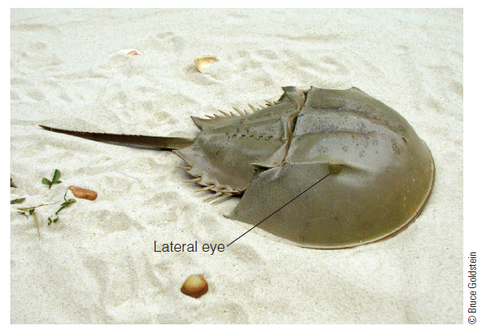

???

Figure 3.1 A Limulus, or horseshoe crab. Its large eyes are made up of **hundreds of ommatidia**, each containing a **single receptor*.

---

.pull-left[
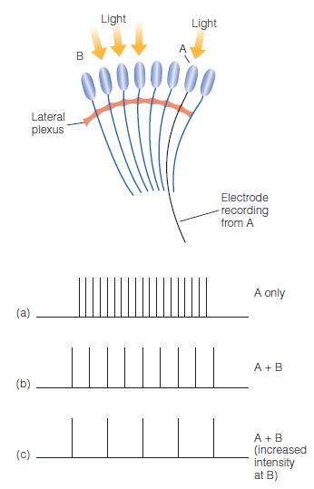
]
.pull-right[
#### Experiments with eye of Limulus  


- **Ommatidia** allow recordings from a *single* receptor.


- (a) Light shown into a *single* receptor leads to rapid firing rate of nerve fiber.


- (b & c) Adding light into **neighboring** receptors leads to .blue[reduced] firing rate of initial nerve fiber.
]


???

Figure 3.2 A demonstration of **lateral inhibition** in the Limulus. The records show the response recorded by the electrode in the nerve fiber of receptor A: 
- (a) when only receptor A is stimulated; 
- (b) when receptor A and the receptors at B are stimulated together; 
- (c) when A and B are stimulated, with B stimulated at an increased intensity. 

---

# .font70[Using Lateral Inhibition to Explain Perception]


---

# .font70[Using Lateral Inhibition to Explain Perception]

Three lightness perception phenomena are explained by **lateral inhibition**.  

.pull-left[
- *Mach Bands*: seeing borders more sharply
  
  
  
- *The Hermann Grid*: seeing spots at an intersection
  
  
  
- *Simultaneous Contrast*: seeing areas of different brightness due to adjacent areas
]
.pull-right[
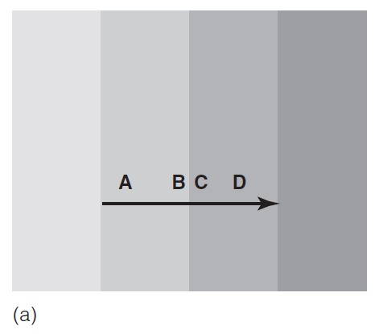  
  
  
  
  
  

]

???

http://www.michaelbach.de/ot/lum-MachBands/index.html

http://www.michaelbach.de/ot/lum-herGridCurved/index.html

http://www.michaelbach.de/ot/lum-inducedContrastAsym/index.html

---

http://www.michaelbach.de/ot/lum-MachBands/index.html

---

# .font70[Problems with the Lateral Inhibition Explanations]

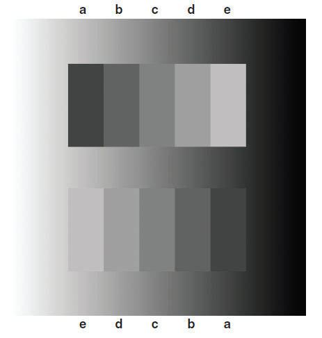


???

Figure 3.13 Two Chevreul staircase patterns that are physically identical, but the one on top has the light rectangle on the right and the one on the bottom has the light rectangle on the left. The patterns look different because they are placed on a luminance ramp that progresses from light on the left to dark on the right. The Chevreul effect is enhanced for the bottom pattern because the light to dark pattern of the Chevreul staircase progresses in the same direction as the luminance ramp. 


---

# .font70[Problems with the Lateral Inhibition Explanations]


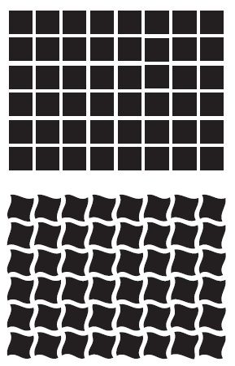


???

Figure 3.14 Top: The Hermann grid display from Figure 3.8, but with more squares. Bottom: The Hermann grid with curved lines. Changing the lines from straight to curved eliminates the illusory dark spots at the intersections. 

---
class: inverse, center, middle

# Processing: Retina, Visual Cortex & Beyond

### Define & identify “receptive field” & discuss techniques to map them.

### Describe the basic function of the LGN, and differentiate among simple cortical cells, complex cortical cells, and end-stopped cortical cells.

---

# .font70[Responding of Single Fibers in the Optic Nerve]

.pull-left[
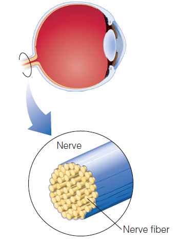
]
.pull-right[
- Area of receptors that affects firing rate of a given neuron in the circuit
- **Receptive fields** are determined by monitoring single cell responses.
- Research example for vision
    - Stimulus is presented to retina and response of cell is measured by an electrode.

]


???

Figure 3.15 The optic nerve, which leaves the back of the eye, contains about one million optic nerve fibers in the human. 

---

# .font70[Responding of Single Fibers in the Optic Nerve]


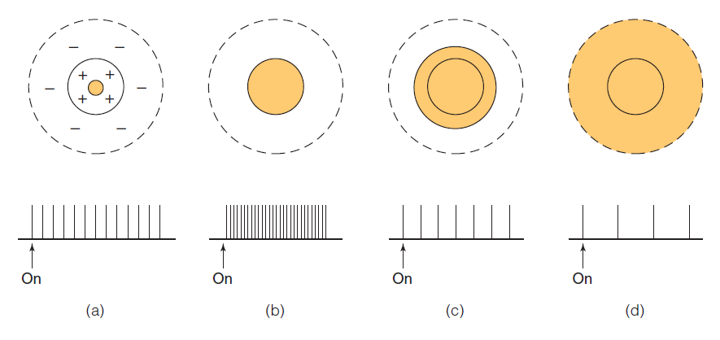

Output of center-surround receptive fields depends on area stimulated:
- Highest response when only the *excitatory* area is stimulated
- Lowest response when only the *inhibitory* area is stimulated
- **Intermediate** responses when **both** areas are stimulated


???

Figure 3.18 Response of an excitatory-center, inhibitory-surround receptive field as stimulus size is increased. Shading indicates the area stimulated with light. The response to the stimulus is indicated below each receptive field. (a) Small response to a small dot in the excitatory center. (b) Increased response when the whole excitatory area is stimulated. (c) Response begins to decrease when the size of the spot is increased so that it stimulates part of the inhibitory surround; this illustrates center-surround antagonism. (d) Covering all of the inhibitory surround decreases the response further.


---

# .font70[Responding of Single Fibers in the Optic Nerve]

.pull-left[
Excitatory (+) & inhibitory (-) receptive fields.

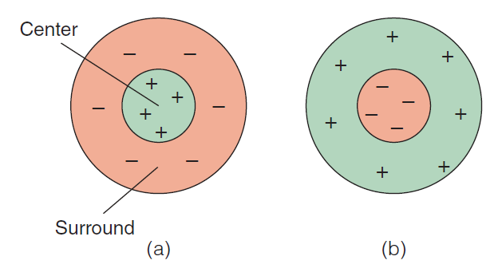

Center and surround areas of receptive fields result in:
- Excitatory-center-inhibitory .blue[surround]
- Inhibitory-.blue[center]-excitatory surround
]

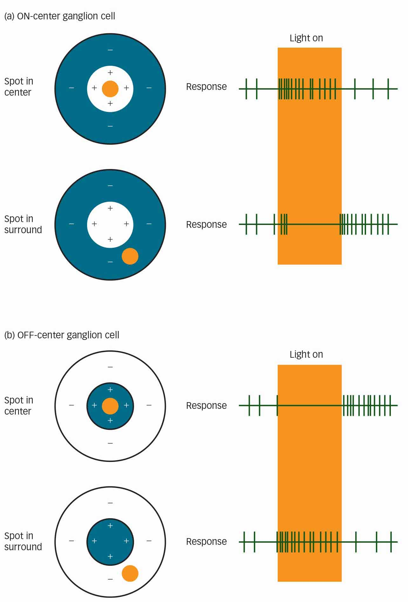

???

Figure 3.17 Center-surround receptive fields: (a) excitatory center, inhibitory surround; (b) inhibitory center, excitatory surround.


---

# .font70[Responding of Single Fibers in the Optic Nerve]

.center[
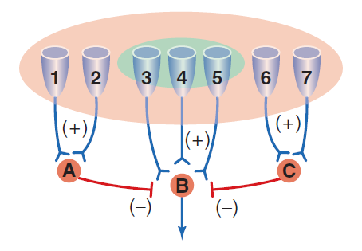
]


???

Figure 3.19 A seven-receptor neural circuit underlying a center-surround receptive field. Receptors 3, 4, and 5 are in the excitatory center, and receptors 1, 2, 6, and 7 are in the inhibitory surround

---

# LGN cells center-surround cells

 Center-On cells
 Center-Off cells

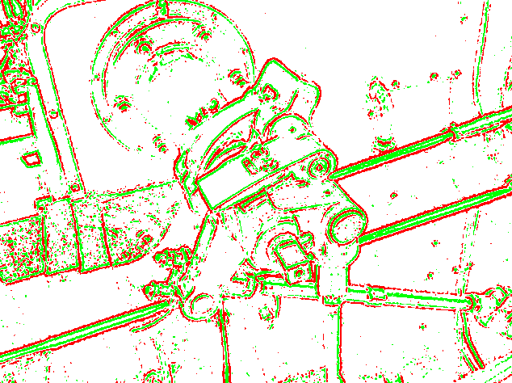

---

# .font60[Hubel and Wiesel’s Rationale for Studying Receptive Fields]
Signals from the retina travel through the optic nerve to the:
- Lateral geniculate nucleus (LGN)
- Primary visual receiving area in the occipital lobe (the striate cortex or area V1)
- And then through two pathways to the temporal lobe and the parietal lobe
- Finally arriving at the frontal lobe

???

- LGN cells have center-surround receptive fields. https://www.youtube.com/watch?v=9qg9-nBjUTc

---

# .font60[Hubel and Wiesel’s Rationale for Studying Receptive Fields]

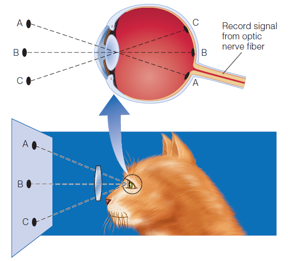


???

Figure 3.20 Recording electrical signals from a fiber in the optic nerve of an anesthetized cat. Each point on the screen corresponds to a point on the cat’s retina


---

# .font60[Hubel and Wiesel’s Rationale for Studying Receptive Fields]

.pull-left[
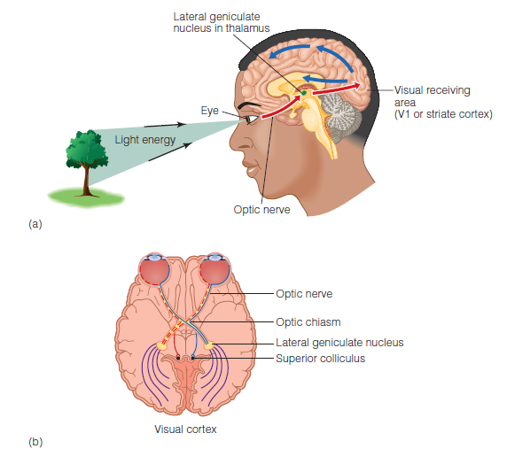
]
.pull-right[
- LGN cells have center-surround receptive fields.
- Major function of LGN is to regulate neural information from the retina to the visual cortex.
    - Signals are received from the retina, the cortex, the brain stem, and the thalamus.
    - Signals are organized by eye, receptor type, and type of environmental information.
]

???

Figure 3.21 a) Side view of the visual system, showing the major sites along the primary visual pathway where processing takes place: the eye, the optic nerve, the lateral geniculate nucleus, and the visual receiving area of the cortex. (b) Visual system seen from underneath the brain, showing the superior colliculus, which receives some of the signals from the eye. The optic chiasm is the place where some of the fibers from each eye cross over to the other side of the brain, so they reach the opposite hemisphere of the visual cortex


---

# Receptive Fields of Neurons in the Visual Cortex

- Neurons that fire to specific features of a stimulus
- Pathway away from retina shows neurons that fire to more complex stimuli.
- Cells that are **feature detectors**:
    - Simple cortical cell
    - Orientation tuning curve
    - Complex cortical cell
    - End-stopped cortical cell


https://www.youtube.com/watch?v=Cw5PKV9Rj3o

???


---

# .font60[Receptive Fields of Neurons in the Visual Cortex]

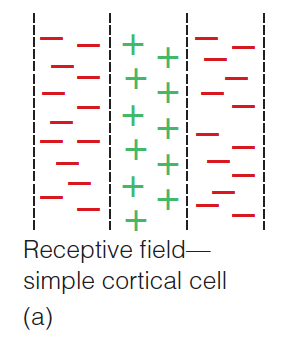


???

Figure 3.23 (a) The receptive field of a simple cortical cell. (b) This cell responds best to a vertical bar of light that covers the excitatory area of the receptive field. (c) The response decreases as the bar is tilted so that it also covers the inhibitory area. (d) Orientation tuning curve of a simple cortical cell for a neuron that responds 
best to a vertical bar (orientation=0). 

---

---

# .font60[Receptive Fields of Neurons in the Visual Cortex]

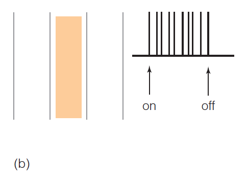


???

Figure 3.23 (a) The receptive field of a simple cortical cell. (b) This cell responds best to a vertical bar of light that covers the excitatory area of the receptive field. (c) The response decreases as the bar is tilted so that it also covers the inhibitory area. (d) Orientation tuning curve of a simple cortical cell for a neuron that responds 
best to a vertical bar (orientation=0). 

---

# .font60[Receptive Fields of Neurons in the Visual Cortex]

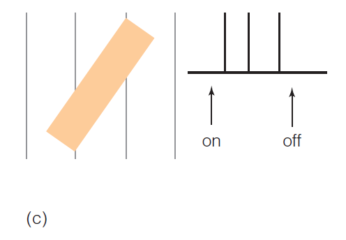


???

Figure 3.23 (a) The receptive field of a simple cortical cell. (b) This cell responds best to a vertical bar of light that covers the excitatory area of the receptive field. (c) The response decreases as the bar is tilted so that it also covers the inhibitory area. (d) Orientation tuning curve of a simple cortical cell for a neuron that responds 
best to a vertical bar (orientation=0). 

---

# .font60[Receptive Fields of Neurons in the Visual Cortex]


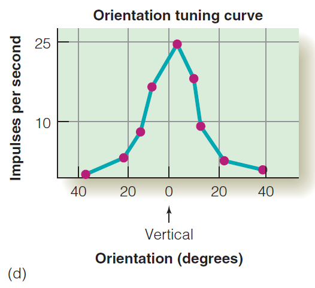


???

Figure 3.23 (a) The receptive field of a simple cortical cell. (b) This cell responds best to a vertical bar of light that covers the excitatory area of the receptive field. (c) The response decreases as the bar is tilted so that it also covers the inhibitory area. (d) Orientation tuning curve of a simple cortical cell for a neuron that responds 
best to a vertical bar (orientation=0). 

---

# .font60[Receptive Fields of Neurons in the Visual Cortex]


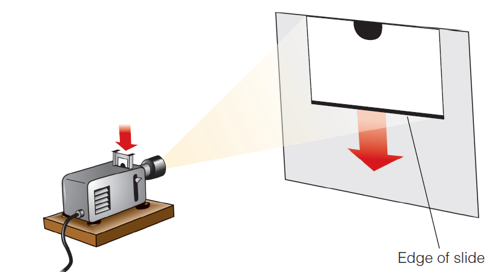


???

Figure 3.24 When Hubel and Wiesel dropped a slide into their slide projector, the image of the edge of the slide moving down unexpectedly triggered activity in a cortical neuron.


---

# .font60[Receptive Fields of Neurons in the Visual Cortex]

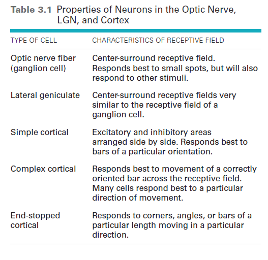


???

---
class: inverse, center, middle

# .font80[Do Feature Detectors Play a Role in Perception?]

### Describe the method used for selective adaptation to orientation, and discuss how the phenomenon is related to feature detectors.

---

# Selective Adaptation

- Neurons tuned to specific stimuli fatigue when exposure is long.

- Fatigue or **adaptation** to stimulus causes
    - Neural firing rate to *decrease*
    - Neuron to fire *less* when stimulus immediately presented again

- **Selective**: only neurons that respond to the **specific stimulus** adapt.

---

# Selective Adaptation

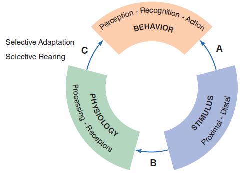

???

Figure 3.26 Three-part version of the perceptual process, repeated from Figure 1.11, showing the three basic relationships: (A) stimulus–perception, (B) stimulus–physiology, and (C) physiology–perception. “Selective Adaptation” and “Selective Rearing” refer to experiments described in the text that were designed to measure relationship C. 

---

# Selective Adaptation

.pull-left[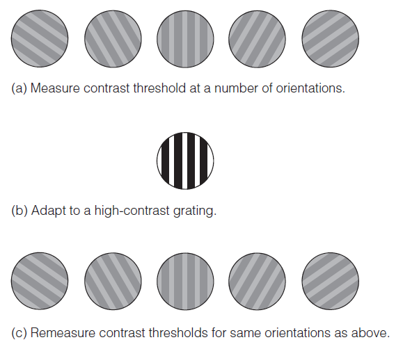]

.pull-right[
- **Measure sensitivity** to range of one stimulus characteristic


- **Adapt** to that characteristic by *extended exposure*


- **Re-measure the sensitivity** to range of the stimulus characteristic
]

???

Figure 3.27 Procedure for carrying out a selective adaptation experiment.


---

# Selective Adaptation

.pull-left[
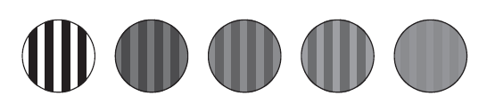
]

.pull-right[

Gratings are used as stimuli.
- Made of alternating light and dark bars
- Angle relative to vertical can be changed to test for sensitivity to orientation.
- Difference in intensity can be changed to test for **sensitivity to contrast**.

]


???

Figure 3.28 The contrast threshold for a grating is the minimum difference in intensity at which the observer can just make out the bars. The grating on the left is far above the contrast threshold. The ones in the middle have less contrast but are still above threshold. The grating on the far right is near the contrast threshold. 


---

# Selective Adaptation


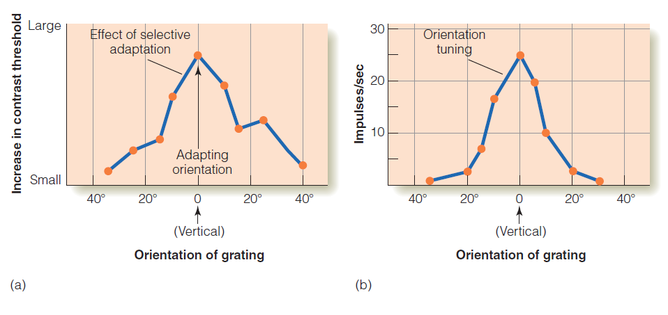

- Measure contrast threshold: decrease intensity of grating until too faint to see.
- Calculate the contrast sensitivity by taking 1/threshold.
- If threshold is low, person has high contrast sensitivity.

???

Figure 3.29 (a) Results of a psychophysical selective adaptation experiment. This graph shows that the person’s adaptation to the vertical grating causes a large decrease in her ability to detect the vertical grating when it is presented again but has less effect on gratings that are tilted to either side of the vertical. (b) Orientation tuning curve of the simple cortical neuron from Figure 3.23.


---

# Selective Rearing

.pull-left[
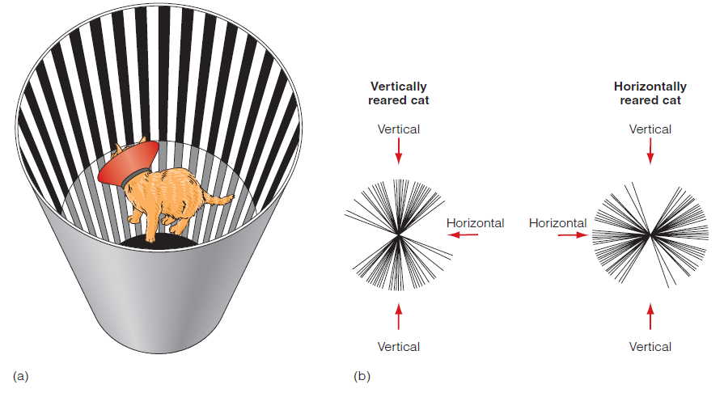
]
.pull-right[
Animals are reared in environments that contain only certain types of stimuli.
- Neurons that respond to these stimuli will become more predominate due to neural plasticity.
- Blakemore and Cooper (1970) showed this by rearing kittens in tubes with either horizontal for vertical lines.
- Both behavioral and neural responses showed the development of neurons for the environmental stimuli.
]

???

Figure 3.30 (a) Striped tube used in Blakemore and Cooper’s (1970) selective rearing experiments. (b) Distribution of optimal orientations for 72 cells from a cat reared in an environment of vertical stripes, on the left, and for 52 cells from a cat reared in an environment of horizontal stripes, on the right. 


---

# Higher-Level Neurons

.pull-left[
- Inferotemporal (IT) cortex
- Prosopagnosia
- Fusiform face area (FFA)
]
.pull-right[
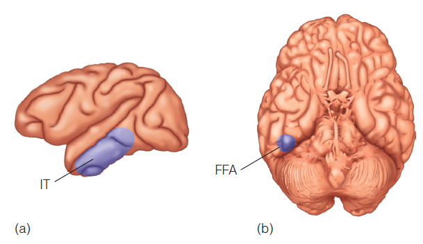
]

???

Figure 3.31 (a) Location of the inferotemporal (IT) cortex in the monkey. (b) Location of the fusiform face area (FFA) in the human, just under the temporal lobe. Both of these areas are rich in neurons that respond to faces. 


---
class: inverse, center, middle

# Higher-Level Neurons

### Contrast specificity coding, distributed coding, and sparse coding.

### Discuss “flexible” receptive fields and explain context modulation.


---

# Higher-Level Neurons


???

Figure 3.32 Some of the shapes used by Gross and coworkers (1972) to study the responses of neurons in the monkey’s inferotemporal cortex. The shapes are arranged in order of their ability to cause the neuron to fire, from none (1) to little (2 and 3) to maximum (6).


---

# Sensory Coding
.pull-left[
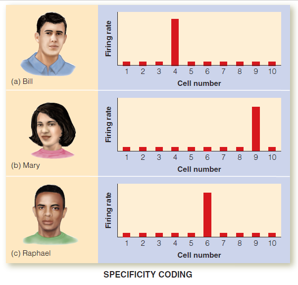
]
.pull-right[
Sensory code: representation of perceived objects through neural firing
- **Specificity coding**: specific neurons responding to specific stimuli
    - Leads to the “**grandmother cell**” hypothesis
    - Recent research shows cells in the hippocampus that respond to concepts such as Halle Berry.
]

???

Figure 3.33 Specificity coding, in which each face causes a different neuron to fire. Firing of neuron 4 signals “Bill”; neuron 9 signals “Mary”; neuron 6 signals “Raphael”.


---

# Sensory Coding
.pull-left[
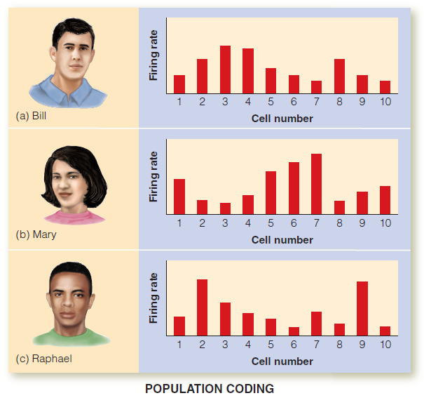
]
.pull-right[
- Problems with specificity coding:
    - Too many different stimuli to assign specific neurons
    - Most neurons respond to a number of different stimuli.
- **Population coding**: pattern of firing across many neurons codes specific objects
    - Large number of stimuli can be coded by a few neurons.
]

???

Figure 3.34 Population coding, in which the face’s identity is indicated by the pattern of firing of a large  number of neurons.

---

# Sensory Coding
.pull-left[
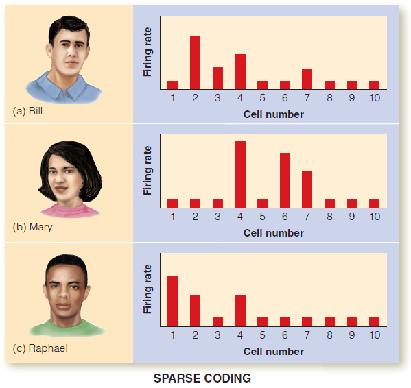
]
.pull-right[
How many neurons are needed for an object in distributed coding?
- **Sparse coding**: only a relatively small number of neurons are necessary
    - This theory can be viewed as a midpoint between specificity and distributed coding.

]

???

Figure 3.35 Specificity coding, in which each face causes a different neuron to fire. Firing of neuron 4 signals “Bill”; neuron 9 signals “Mary”; neuron 6 signals “Raphael.”


---

# Sensory Coding


???

Figure 3.36 Records from a neuron in the temporal lobe that responded to different pictures of Steve Carell similar to the ones shown here (top records) but which did not respond to pictures of other well-known people (bottom records). 


---

# “Flexible” Receptive Fields
.pull-left[
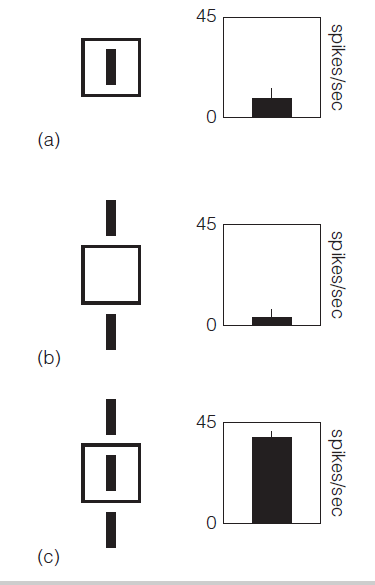

]

--


.pull-right[
- Perceptual system needs to be flexible.
- Kapadia’s (2000) research
    - The response to stimulation within the receptive field can be affected by what’s happening outside the receptive field.
- Contextual modulation
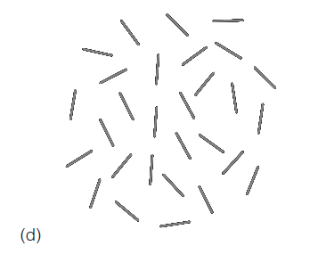
]


???

Figure 3.37 A neuron in the monkey’s temporal lobe responds (a) with a small response to a vertical bar flashed inside the receptive field (indicated by the square); (b) with little or no response to two vertical bars presented outside the receptive field; (c) with a large response when the three bars are presented together. This enhanced response caused by stimuli presented outside the receptive field is called contextual modulation. (d) A pattern in which the three aligned lines stand out. 

