class: inverse, center, middle

```{r setup, include=FALSE}
options(htmltools.dir.version = FALSE)
```

### Scanning a Scene
### What Are the Benefits of Attention?
### Attention and Experiencing a Coherent World
### What Happens When We Don’t Attend?
### Distraction

---
class: inverse, center, middle


# Scanning a Scene

### Define attention and explain why attention is necessary.
### Identify the factors that determine where a person looks in </br> a visual scene with supporting examples from research studies.
### Describe Posner et al.’s (1978) precueing task and what it revealed about attention.

---

# Scanning a Scene
- Visual scanning - looking from place to place
    - Fixation
    - Saccadic eye movement
- Overt attention involves looking directly at the attended object.
- Covert attention refers to attention without looking.

---

# Scanning a Scene

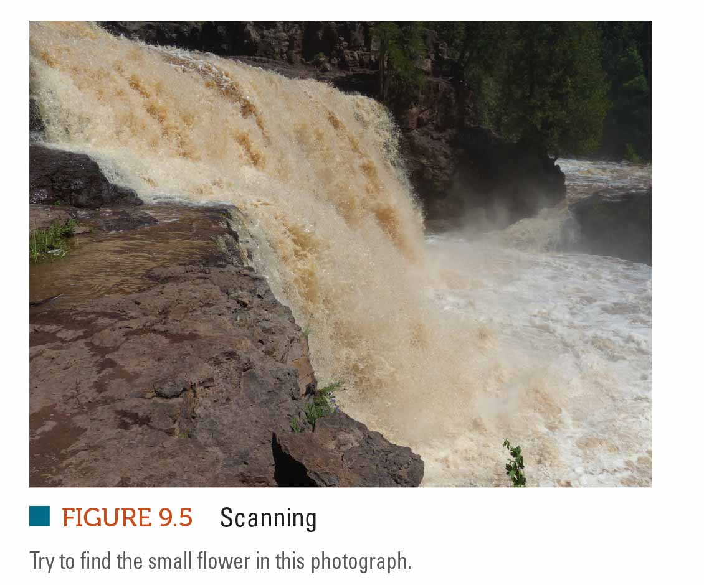

???

---

# Scanning a Scene


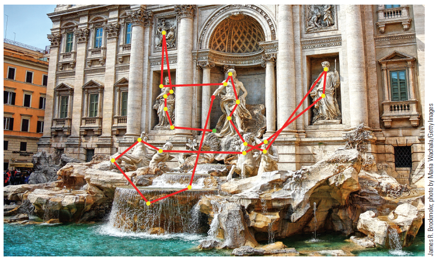

???
Figure 6.2 Scan path of a person freely viewing a picture. Fixations are indicated by the yellow dots and saccadic eye movements by the red lines. Notice that this person looked preferentially at areas of the picture such as the statues by ignored areas such as the water, rocks, and buildings.

---

# Eyetracking

.pull-left[
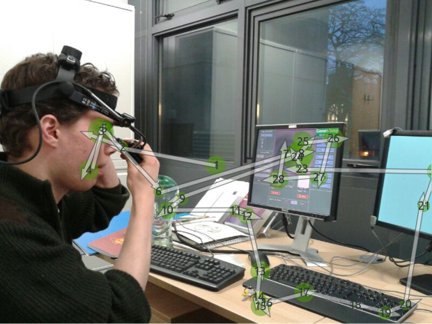
]
.pull-right[

]

Dalmaijer, E. S., Mathôt, S., & Van der Stigchel, S. (2014). PyGaze: An open-source, cross-platform toolbox for minimal-effort programming of eyetracking experiments. Behavior research methods, 46(4), 913-921.

---

# Eyetracking

.pull-left[

]
.pull-right[
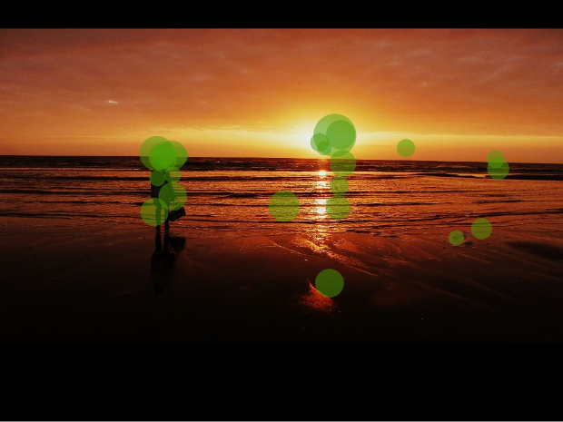
]

Dalmaijer, E. S., Mathôt, S., & Van der Stigchel, S. (2014). PyGaze: An open-source, cross-platform toolbox for minimal-effort programming of eyetracking experiments. Behavior research methods, 46(4), 913-921.

---

# Eyetracking

.pull-left[
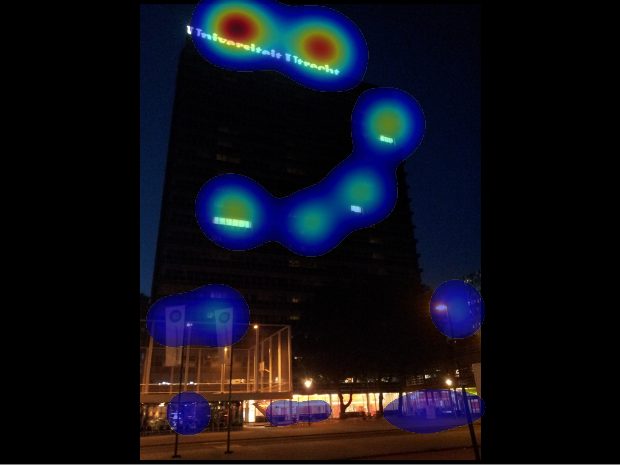
]
.pull-right[
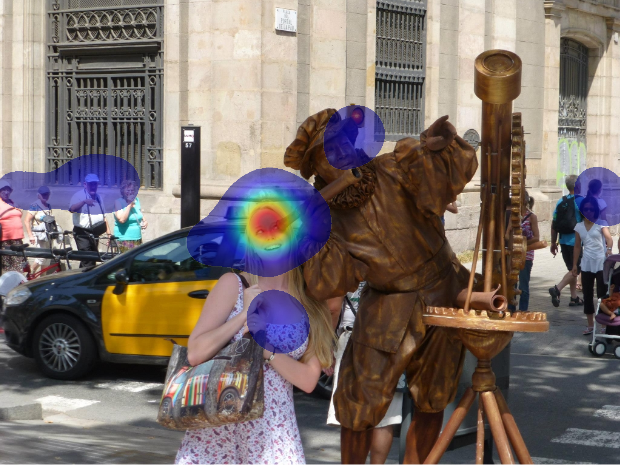
]

Dalmaijer, E. S., Mathôt, S., & Van der Stigchel, S. (2014). PyGaze: An open-source, cross-platform toolbox for minimal-effort programming of eyetracking experiments. Behavior research methods, 46(4), 913-921.


---

# What Directs Our Attention?

.pull-left[

- Characteristics of the scene:
    - Visual salience: areas of stimuli that attract attention due to their properties
    - Color, contrast, and orientation are relevant properties.
- Attentional capture

]
.pull-right[

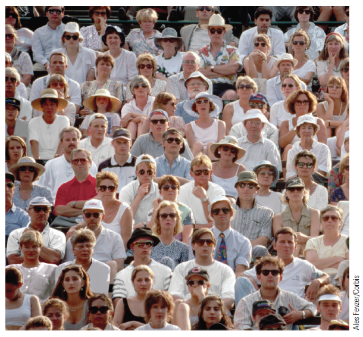
]

???
Figure 6.3 The red shirt is visually salient because it is bright and contrasts with its surroundings.


---

# What Directs Our Attention?

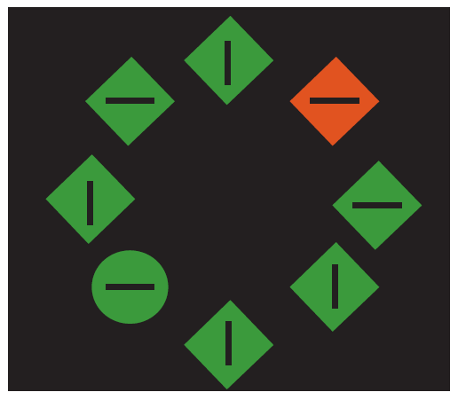

???

Figure 6.4 An example of attentional capture. When subjects are instructed to find the green circle, they often look at the red diamond first.


---

# What Directs Our Attention?


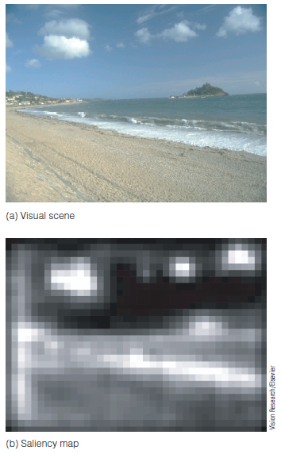

???

Figure 6.5 (a) A visual scene. (b) Saliency map of the scene determined by analyzing the color, contrast, and orientations in the scene. Lighter areas indicate greater salience. 


---

# Cognitive Factors
- Picture meaning and observer knowledge
    - Scene schema: prior knowledge about what is found in typical scenes
- Fixations are influenced by this knowledge.

---

# Cognitive Factors
- Experiment by Shinoda et al.
    - Observers' fixations were measured during computer simulated driving.
- They were more likely to detect stop signs when they were at intersections.
- They have learned that this is where stop signs are typically placed.

---

# Cognitive Factors


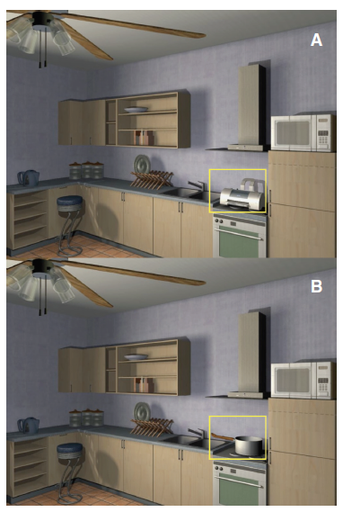

???

Figure 6.6 Stimuli used by Võ and Henderson (2009). Subjects spent more time looking at (a) the printer than at (b) the pot, shown inside the yellow rectangles (which were not visible to the subjects). 

---

# Cognitive Factors

- One way to show that where we look isn't determined only by saliency is by checking the eye movements of the subject.
    - Meaning likely has attracted attention
- Attention can be influenced by a person's goals.

---

# Cognitive Factors

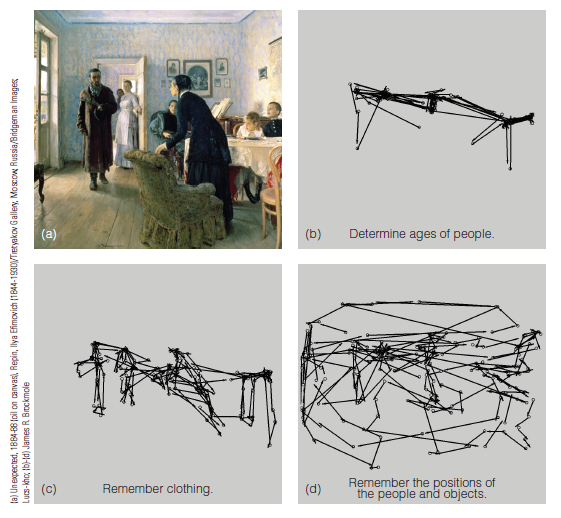

???

Figure 6.7 Yarbus (1967) asked subjects to view the painting in (a) and recorded their eye movements while they had to (b) estimate the ages of the people, (c) remember the clothes worn by the people, or (d) remember the positions of all the people and objects in the room. The figure shows data collected by James Brockmole using Yarbus’ original procedures combined with modern eye tracking technology. Results show that subjects’ eye movements are strongly influenced by the task


---

# Task-Related Knowledge

.pull-left[
- Determine where people look as they carry out tasks.
- Timing of when people look at specific places is determined by the sequence of actions involved in the task.

]
.pull-right[

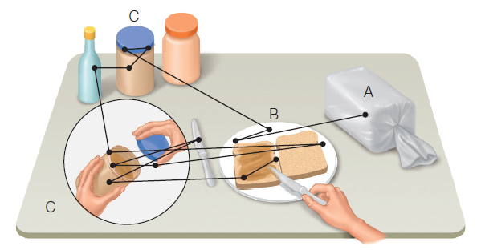
]

???

Figure 6.8 Sequence of fixations of a person making a peanut butter sandwich. The first fixation is on the loaf of bread.


---

# What Are the Benefits of Attention?

.pull-left[
- Spatial attention: attention to specific locations
- Experiment by Posner (1978) et al.
    - Observers looked at a fixation point.
    - Precueing with an arrow indicated on which side a stimulus was likely to appear.
    - Stimuli appeared that were consistent (valid trial) or inconsistent (invalid trial) with the cue.
    - Task was to push button when a target square was seen.
]
.pull-right[

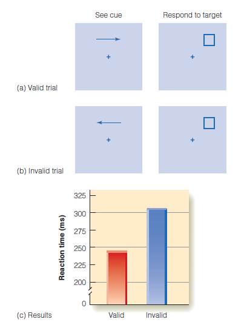
]

???

Figure 6.9 Procedure for the (a) valid task and (b) invalid task in Posner and coworkers’ (1978) precueing experiment. See text for details. (c) The results of the experiment. The average reaction time was 245 ms for valid trials but 305 ms for invalid trials. 


---

# Attention Speeds Responding

.pull-left[
- Results of Posner experiment showed that observers responded fastest on valid trials.
- Posner believed these results showed that information processing is most efficient where attention is directed.

]
.pull-right[


]

???

Figure 6.9 Procedure for the (a) valid task and (b) invalid task in Posner and coworkers’ (1978) precueing experiment. See text for details. (c) The results of the experiment. The average reaction time was 245 ms for valid trials but 305 ms for invalid trials. 


---
class: inverse, center, middle

# What Are the Benefits of Attention?

  

  
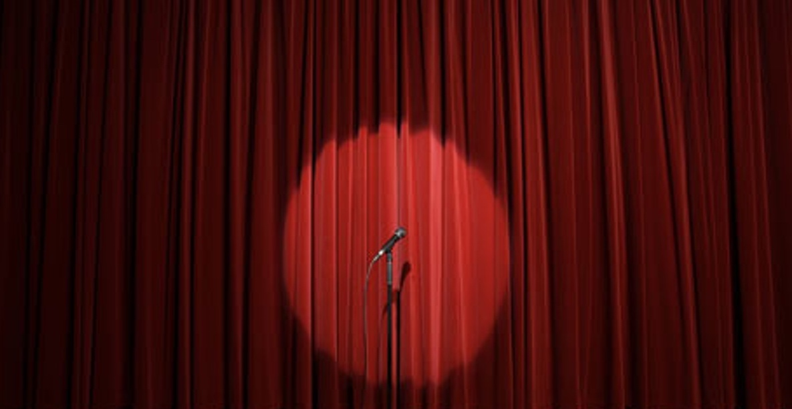
  

---

# Spotlight of Attention

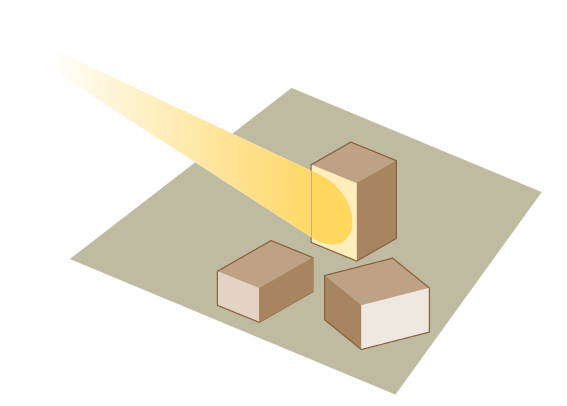

???

Figure 6.10 Spatial attention can be compared to a spotlight that scans a scene.


---

# What Directs Attention? 

## Cognitive Factors


|Cause |Authors|Figure #|Measure (DV)|
|---|---|---|---|
| Schema-directed | Võ & Henderson (kitchen scene context)| 6.6 | Eye Movements |
| Goal-directed | Yarbus (remember painting) | 6.7 | Eye Movements |
| Knowledge-directed | Land & Hayhoe (sandwich ingredients)| 6.8  | Eye Movements |

---

# Experiments on Benefits of Attention 

## Behavior
  

  
|Attention Effect |Authors|Figure #|Measure (DV)|
|---|---|---|---|
| Spatial speed enhancement | Posner| 6.9 | Reaction Time |
| Object speed enhancement | Egly | 6.11 | Reaction Time |
| Appearance enhancement | Carrasco | 6.13 | Contrast judgement |
  
## Physiology
  

  
|Attention Effect |Authors|Figure #|Measure (DV)|
|---|---|---|---|
| Object Enhancement  | O'Craven | 6.14 | fMRI BOLD |
| Spatial Enhancement | Datta & DeYoe | 6.15a | fMRI BOLD
|  Spatial Enhancement | Womelsdorf | 6.15b |electrophysiology|
|  Enhanced Synchrony | Bosman | 6.16 |electrophysiology|


---
class: inverse, center, middle

# Attention and Experiencing a Coherent World  

### Describe the link between neural responding and attention.  
  

---

# .font60[Attention and Experiencing a Coherent World]

- Binding: process by which features are combined to create perception of coherent objects
- Binding problem: features of objects are processed separately in different areas of the brain
- So, how does binding occur?

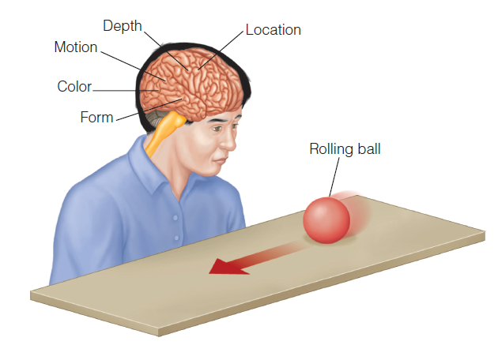

???

Figure 6.18 Any stimulus, even one as simple as a rolling ball, activates a number of different areas of the cortex. Binding is the process by which these separated signals are combined to create a unified perception.


---

# Feature Integration Theory
- Preattentive stage: features of objects are separated.
- Focused attention stage: features are bound into a coherent perception.


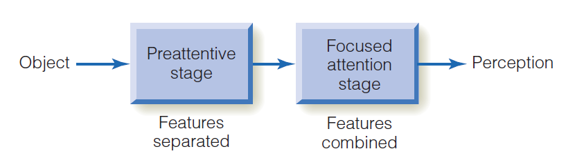

???

Figure 6.19 Flow diagram of Treisman’s (1988) feature integration theory. 


---

# Attentional Blink

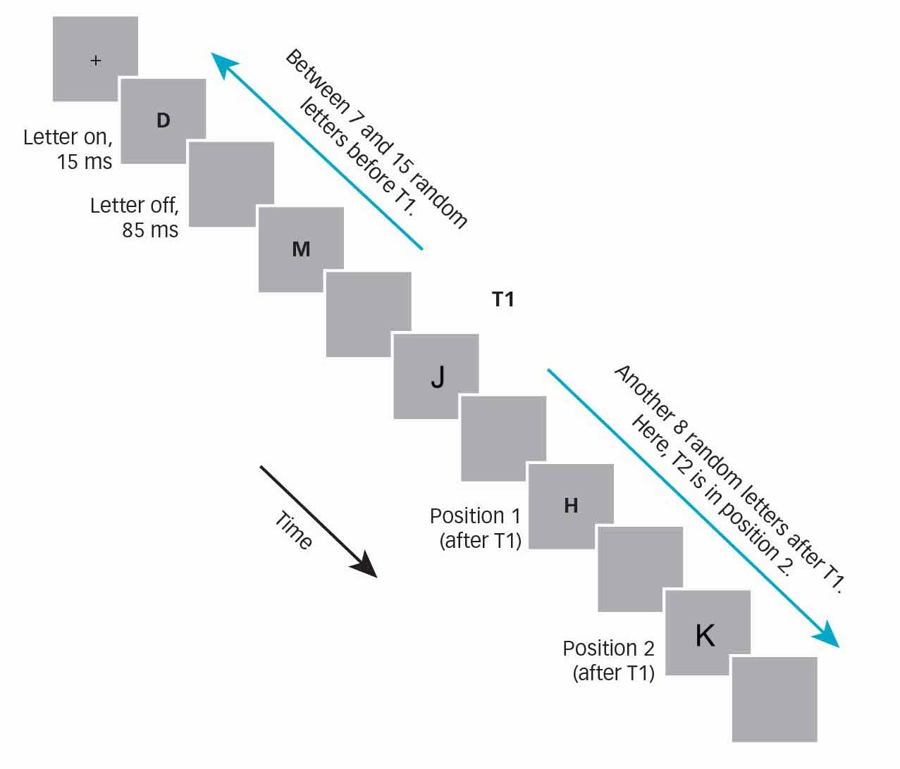

---
class: inverse, center, middle

# What Happens When We Don’t Attend?

### Define change detection, change blindness, and continuity errors.
### Describe how the dual-task procedure has been used to determine the role of attention in scene perception; also discuss findings from those studies.


---

# What Happens When We Don't Attend?
- Inattentional blindness
    - Subjects can be unaware of clearly visible stimuli if they aren't directing their attention to them.

www.youtube.com/watch?v=vJG698U2Mvo


---

# Inattentional Blindness


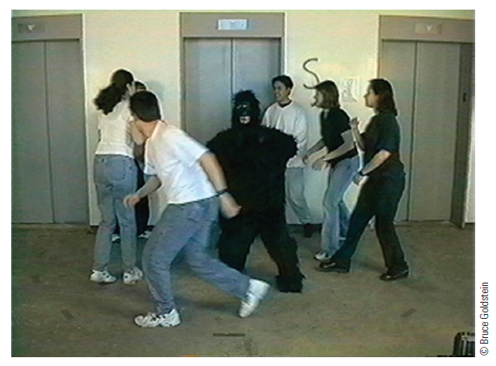

???

Figure 6.24 Frame from Simons and Chabris’s (1999) experiment. 

---

# Inattentional Blindness


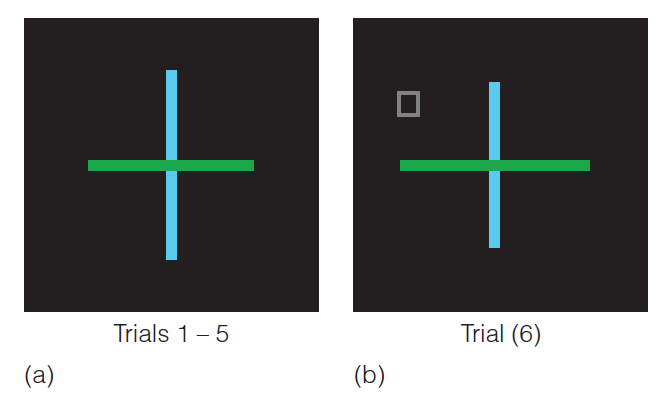

???

Figure 6.23 Inattentional blindness experiment. (a) The cross display is presented for five trials. One arm of the cross is slightly longer on each trial. The subject’s task is to indicate which arm (horizontal or vertical) is longer. (b) On the sixth trial, the subjects carry out the same task, but a small square is included in the display. After the sixth trial, subjects are asked if they saw anything different than before. 


---

# Change Blindness
- Observers were shown a picture with and without a missing element in an alternating fashion with a blank screen.
- Results showed that the pictures had to alternate a number of times before the change was detected.
- When a cue is added to show where to attend, observers noticed change more quickly.

---

# Change Blindness
- Change blindness also occurs for film shots.
- People are "blind" to the fact that they experience change blindness.
- Real objects in the environment change with some type of movement, which is why we normally don't experience change blindness.


---

# Change Blindness

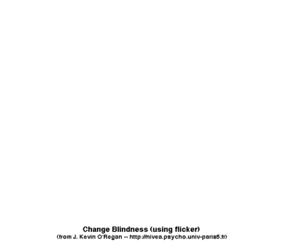


???


Figure 6.25 Stimulus for change-blindness demonstration. 


---

# Change Blindness

http://channel.nationalgeographic.com/brain-games/videos/brain-games-pay-attention/


---

# Change blindness OR Inattentional blindness

> *Change* blindness refers to the failure to **notice something different** about a display whereas *inattentional* blindness refers to a failure to **see something present** in a display. [-Scholarpedia](http://www.scholarpedia.org/article/Inattentional_blindness#Change_blindness_or_inattentional_blindness)


---
class: inverse, center, middle

# Distraction  
  

  
### Describe the load theory of attention & how it accounts for </br> interaction between task difficulty & distraction.

### Compare and contrast feature and conjunction searches.

---

# Distraction

.pull-left[
- Task-irrelevant stimuli are stimuli that do not provide information relevant to the task.
- Forster and Lavie (2008)
    - Load theory of attention
    - Perceptual capacity
    - Perceptual load
    - Low-load tasks
]

.pull-right[

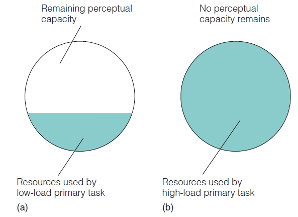
]

???

Figure 6.29 The rationale for the idea that (a) low-load tasks that use few cognitive resources may leave resources available for processing unattended task-irrelevant stimuli, whereas (b) high-load tasks that use all of a person’s cognitive resources don’t leave any resources to process unattended task-irrelevant stimuli.

