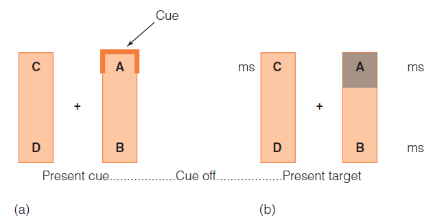
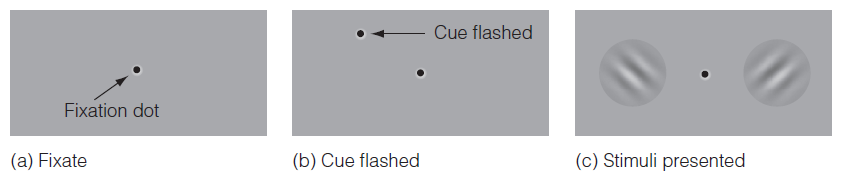
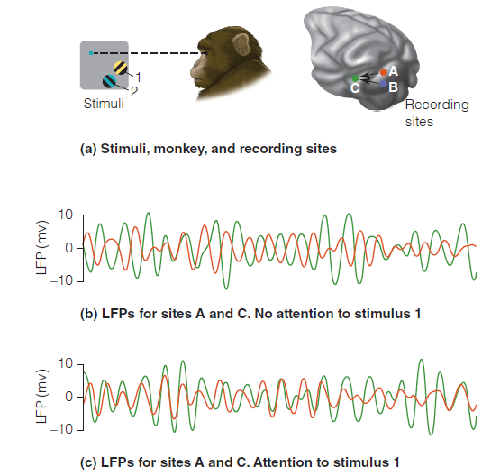
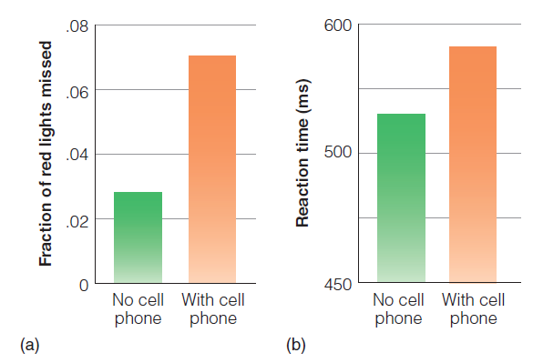

# Slides 20-25 ------------------------------------------------------------

---

# Attention Speeds Responding

.pull-left[
- Experiment by Egly et al.
    - Observer views two rectangles.
    - Cue signals where target may appear.
    - Task: to press button when target appeared.
    - Results: 
- Fastest reaction time was at targeted position.
- "Enhancement" effect for non-target was within the target rectangle.

]
.pull-right[

]

???

Figure 6.11 In Egley and coworkers’ (1994) experiment, (a) a cue signal appears at one place on the display, then the cue is turned off and (b) a target is flashed at one of four possible locations, A, B, C, or D. Numbers are reaction times in ms for positions A, B, and C, when the cue appeared at position A.

---

# Attention Can Influence Appearance

- Experiment by Carrasco et al.
    - Observers saw two grating stimuli with either similar or different contrast between the bars.
    - Task was to fixate on center point between gratings and indicate orientation of bars with higher contrast.
    - Small dot was flashed very quickly on one side before gratings appeared.

???

Figure 6.13 Procedure for Carrasco and coworkers’ (2004) experiment. See text for explanation.

---

# Attention Can Influence Appearance
- Carrasco results:
    - When there was a large difference in contrast, the dot had no effect.
    - When the contrast was the same, observers were more likely to report that the grating preceded by the dot had higher contrast.
    - Thus, the shift of attention led to an effect on perception.

---

# .font70[Attention Can Influence Physiological Responding]

.pull-left[
- O'Craven (1999): subject attended to the house or face show that attending to the moving or stationary face caused enhanced activity in the FFA and attending to the moving or stationary house caused enhanced activity in the PPA

]
.pull-right[

]

???

Figure 6.14 (a) Superimposed face and house stimulus used in O’Craven and coworkers’ (1999) experiment. (b) FFA activation when the subject attended to the face or the house. (c) PPA activation for attention to the face or the house. 

---

# .font70[Attention Can Influence Physiological Responding]

.pull-left[
- Datta and DeYoe (2009)
    - Attention maps show directing attention to a specific area of space activates a specific area of the brain.
- Womelsdorf (2006)
    - Showed that attention can cause a monkey's receptive field to shift toward the place where the attention is directed

]
.pull-right[

]

???

Figure 6.15 (a) Subjects in Datta and DeYoe’s (2009) experiment directed their attention to different areas of this circular display while keeping their eyes fixed on the center of the display. (b) Activation of the brain that occurred when the subjects attended to the areas indicated by the letters on the stimulus disc. The center of each circle is the place on the brain that corresponds to the center of the stimulus. The yellow “hot spot” is the area of the brain that is maximally activated by attention. 

---
  
  # .font70[Attention Can Influence Physiological Responding]
  
  .pull-left[
    - Attention also causes changes in the relationship between activity in different areas of the brain. 
    - Local field potential
    - Bosman and colleagues research
    - Communication through coherence 
    
    ]
.pull-right[
  
  
  ]

???
  
  Figure 6.16 In the Bosman et al. (2012) experiment. (a) the monkey kept eyes fixed on the blue dot and paid attention to either stimulus 1, which caused LFP responding in A and C, or stimulus 2, which caused LFP responding in B and C. (b) LFP responses recorded from sites A (red) and C (green) when monkey was not attending to stimulus 1. (c) LFP responses recorded from A and C when monkey was attending to stimulus 1. Notice that the responses are more synchronized in (c). 

# Slides 27-28 ------------------------------------------------------------

---
  
  # Feature Integration Theory
  
  .pull-left[
    - Illusory conjunctions: features that should be associated with an object become incorrectly associated with another.
    - Experiment by Triesman & Schmidt
    - Stimulus was four shapes flanked by two numbers.
    - Display flashed briefly, followed by a mask.
    - Task was to report numbers first followed by shapes at four locations.
    ]
.pull-right[
  
  ]

???
  
  Figure 6.20 Stimuli for Treisman and Schmidt’s (1982) experiment. When subjects first attended to the black numbers and then to the other objects, some illusory conjunctions, such as “green triangle,” occurred.

---
  
  # Feature Integration Theory
  - Triesman & Schmidt results:
  - Incorrect associations of features with objects occurred 18% of the time.
- Asking observers to focus on the target objects eliminated this effect.
- Balint's syndrome: patients with parietal lobe damage show lack of focused attention results in incorrect combinations of features

# Slide 39 ------------------------------------------------------------

---

# .font70[Is Attention Necessary for Perceiving Scenes?]

.pull-left[
- Experiment by Li et al. (2002)
    - Observers performed one of three tasks.
- Central task: determine whether letters flashed in the center of the screen are the same
- Peripheral task: determine whether faces flashed to the side of the screen are male or female
- Dual task: do the same as the peripheral task and determine the color of a disc.

]
.pull-right[

]

???

Figure 6.26 (a–c) Procedure for Li and coworkers’ (2002) experiment. See text for details. (d) Results of the experiment. Performance is the percent correct when carrying out the central task compared to the percent correct when not carrying out the central task. Performance drops only slightly for the scene, but drops to near chance for the colored-disc task. 

# Slide 42 ------------------------------------------------------------

---

# Distracted Driving

.pull-left[
- Driving requires constant attention.
- Strayer and Johnston research (2001) on cell phone use and driving
    - Anything that distracts attention can degrade driving performance.

]
.pull-right[

]

???

Figure 6.30 Results of Strayer and Johnston’s (2001) cell phone experiment. When subjects were talking on a cell phone, they (a) missed more red lights and (b) took longer to apply the brakes.

