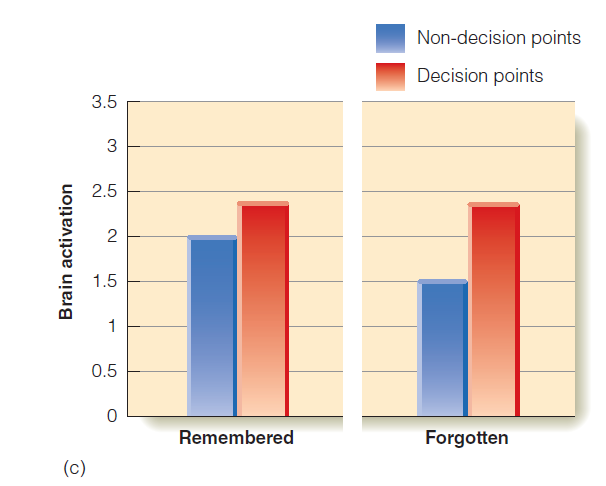

class: inverse, center, middle

```{r setup, include=FALSE}
options(htmltools.dir.version = FALSE)
```

# The Ecological Approach to Perception
####	Discuss historical background of ecological approach to perception.


---

## The Ecological Approach to Perception
- Approach developed by J. J. Gibson (began in late 1950s)
    - Gibson felt that traditional laboratory research on perception was:
- Too artificial- observers were not allowed to move their heads.
- Unable to provide an explanation for how pilots used environmental information to land airplanes

---

## The Ecological Approach to Perception
- Optic flow: appearance of objects as the observer moves past them
    - Gradient of flow: difference in flow as a function of distance from the observer
    - Focus of expansion: point in distance where there is no flow

---

## Invariant Information
- Invariant information: properties that remain constant while the observer is moving

---

## Self -Produced Information
- Somersaulting
    - Can be performed by learning a predetermined sequence of moves
    - Thus, will performance be the same with and without vision?
    - Bardy and Laurent found that expert gymnasts performed worse with their eyes closed.
- They use vision to correct their trajectory.
- Novice gymnasts do not show this effect.

---

## Self-Produced Information


???

Figure 7.5 “Snapshots” of a somersault, or backflip, starting on the left and finishing on the right. 


---

## The Senses Do Not Work in Isolation

.pull-left[

- Experiment by Lee and Aronson
    - 13- to 16 -month -old children placed in "swinging room"
- In the room, the floor was stationary but the walls and ceiling swung backward and forward.
- The movement creates optic flow patterns.
    - Children swayed back and forth in response the flow patterns created in the room.
]
.pull-right[


]

???

Figure 7.6 Lee and Aronson’s swinging room. 
- (a) Moving the room toward the observer creates an optic flow pattern associated with moving forward, 
- so (b) the observer sways backward to compensate. 


---

## The Senses Do Not Work in Isolation


???

Figure 7.6 Lee and Aronson’s swinging room. 
- (c) As the room moves away from the observer, flow corresponds to moving backward, so the person leans forward to compensate and may even lose his or her balance. 


---

## The Senses Do Not Work in Isolation
- Adults show the same response as children when placed in the swinging room.
- Results show that vision has a powerful effect on balance and even overrides other senses that provide feedback about body placement and posture.


---
class: inverse, center, middle

# Staying on Course: Walking and Driving

#### Apply the concepts of optic flow (such as invariance and FOE) <br/> to a person driving a car.
#### Describe how people use flow information when driving and the research showing that people do not need to have flow information when walking.


---

## Walking
- Visual direction strategy: observers keep their body pointed toward a target
    - Walkers correct when target drifts to left or right.
- Blind walking experiments show that people can navigate without any visual stimulation from the environment.

---

## Walking


???

Figure 7.7 
- (a) As long as a person is moving toward the tree, it remains in the center of the person’s field of view. 
- (b) When the person walks off course, the tree drifts to the side. 

---

## Walking


???

Figure 7.8 A “blind walking” experiment (Philbeck et al., 1997). Red line: Subjects closed their eyes, walked toward a target 6 meters away, and stopped when they thought they had reached it. Green line: With closed eyes, subjects began walking in the wrong direction. Blue lines: Keeping their eyes closed, subjects turned at point 1 or point 2 and continued walking until they thought they had reached the target.


---

## Walking


???

Figure 7.7 
- (c) When the person corrects the course, the tree moves back to the center of the field of view, 
- until (d) the person arrives at the tree


---

## Driving a Car
- Experiment by Land and Lee
    - Car fitted with instruments to measure
- Angle of steering wheel
- Speed of vehicle
- Direction of gaze of driver
    - When driving straight, driver looks straight ahead, but not at focus of expansion.


???

Figure 7.9 Results of Land and Lee’s (1994) experiment. Because this study was conducted in the United Kingdom, subjects were driving on the left side of the road. The ellipses indicate the place where the drivers were most likely to look while driving down (a) a straight road and (b) a curve to the left. 

---
class: inverse, center, middle

# Wayfinding
#### Discuss the role of landmarks in wayfinding, <br/> and the Gibsonian term “affordances”.
#### Identify the neurons and brain areas that are believed to be responsible for navigation, and discuss findings from patients with brain damage in relation to wayfinding and affordances.


---

## Wayfinding
- Landmarks involved taking routes that require making turns.
- Landmarks are objects on the route that serve as cues to indicate where to turn.

---

## Wayfinding
- Experiment by Janzen and van Turennout
    - Observers studied a film that moved through a "virtual museum."
    - They were told that they should be able to act as a guide within the museum.
    - Exhibits appeared both at decision points where turns were necessary and non-decision points.

---

## Wayfinding
- Observers were given a recognition task while in an fMRI.
    - They were presented with objects they had seen as exhibits, as well as ones they had not seen.
- Results showed the greatest activation for objects at decision points (landmarks) in the parahippocampal 
gyrus.

---

## Wayfinding

.pull-left[

]
.pull-right[

]

???

Figure 7.11 (a & b) Two locations in the “virtual museum” viewed by Janzen and van Turennout’s (2004) observers. (c) Brain activation during the recognition test for objects that had been located at decision points (red bars) and non-decision points (blue bars). Notice that brain activation was greater for decision-point objects even if they weren’t remembered.


---

## The Brain's "GPS"
- Tolman's experiments with rat in a maze
    - Rat created a cognitive map.
- O'Keefe
    - Place cells
    - Place field
- Moser and Moser 
    - Grid cells

---

## The Brain's "GPS"


???
Figure 7.12 Maze used by Tolman. (a) The rat initially explores the maze. (b) The rat learns to turn right to obtain the food at B when it starts at A. (c) When placed at C, the rat turns left to reach the food at B. In this experiment, precautions were taken to prevent the rat from knowing where the food was based on cues such as smell. 


---

## The Brain's "GPS"


???

Figure 7.13 A record similar to those O’Keefe produced by recording from neurons in a rat’s hippocampus as it walked inside a box. (a) The path taken by a rat in a box is outlined in gray. The positions within the box where four places cells fired are highlighted by red, blue, purple, and green dots. (b) The positions within the box where three grid cells fired are denoted by orange, blue, and green dots. See text for details

---

## Place Cells

<iframe width="750" height="415" src="https://www.youtube.com/watch?v=Vf_m65MLdLI?start=0" frameborder="0" allowfullscreen></iframe>

https://www.youtube.com/watch?v=Vf_m65MLdLI?start=0
---

## Head Direction Cells

<iframe width="750" height="415" src="https://www.youtube.com/embed/Uw1nxuVAqOE?start=21" frameborder="0" allowfullscreen></iframe>

---

## Individual Differences in Wayfinding
- Experience 
- Maguire and colleagues (2006)
    - London bus drivers vs. London taxi drivers

---

## Individual Differences in Wayfinding


???

Figure 7.15 (a) Performance on a landmark test by London taxi drivers and bus drivers. A perfect score is 48. (b) Cross section of the brain. Yellow indicates greater hippocampus volume in London taxi drivers compared to London bus drivers, as determined by magnetic resonance imaging. 


---

## Affordances - What Objects Are Used For
- Gibson believed affordances of objects are made up of information that indicates what an object is used for.
    - In other words, they indicate a "potential for action" as part of our perception.
    - People with certain types of brain damage show that even though they may not be able to name objects, they can still describe how they are used or can pick them up and use them.

---
class: inverse, center, middle

# Acting on Objects
#### Describe the procedure, results, and conclusions of studies on the physiology of reaching and grasping in both monkeys and humans.


---

## The Physiology of Reaching and Grasping
- Dorsal and ventral pathways
    - Identify the object (ventral).
    - Position hand and fingers to grasp (dorsal).
- Parietal reach region
    - Fattori and colleagues (2010): monkey hand grip experiment

---

## The Physiology of Reaching and Grasping


???

Figure 7.16 Picking up a cup of coffee: (a) perceiving and recognizing the cup, (b) reaching for it, and (c) grasping and picking it up. This action involves coordination between perceiving and action that is carried out by two separate streams in the brain, as described in the text.


---

## The Physiology of Reaching and Grasping


???

Figure 7.17 Monkey cortex showing location of the parietal reach region (PRR) and the area of premotor cortex where mirror neurons were found. Areas MT, MST, and PFC are discussed in Chapter 8. 


---

## The Physiology of Reaching and Grasping


???

Figure 7.18 The monkey’s task in Fattori and coworkers’ (2010) experiment. The monkey always looked at the small light above the sphere. The monkey sees the object to be grasped when the lights go on, the reaches for and grasps the object once the lights go off and the fixation light changes color. 

---
class: inverse, center, middle

# Observing Other People’s Actions
#### Explain what mirror neurons are and how they were discovered.
#### Debate why many focus on perception as a tool for action and survival instead of focusing only on perception as a tool for developing mental representations.

---

https://www.ted.com/talks/vilayanur_ramachandran_on_your_mind?language=en&utm_campaign=tedspread--a&utm_medium=referral&utm_source=tedcomshare?start=600

---

## Mirroring Others' Actions in the Brain
- Mirror neurons in the cortex of monkeys respond when a monkey grasps an object and when an experimenter grasps an object.
    - Response to the observed action "mirrors" the response of actually grasping.
    - There is a diminished response if an object is grasped by a tool (such as pliers).

---

## Mirroring Others' Actions in the Brain


???

Figure 7.20 Response of a mirror neuron. (a) Response to watching the experimenter grasp food on the tray. (b) Response when the monkey grasps the food. (c) Response to watching the experimenter pick up food with a pair of pliers

---

https://www.youtube.com/embed/yacL60710hg?start=274

---

## Mirroring Others' Actions in the Brain


???

Figure 7.22 Cortical areas in the human brain associated with the mirror neuron system. Colors indicate the type of actions processed in each region: turquoise, movements directed toward objects; purple, reaching movements; orange, tool use; green, movements not directed toward objects; blue, upper limb movements. 


---

## Mirroring Others' Actions in the Brain
- Possible functions of mirror neurons
    - To help understand another animal's actions and react to them appropriately
    - To help imitate the observed action
- Audiovisual mirror neurons: respond to action and the accompanying sound.
- Mirror neurons may help link sensory perceptions and motor actions.

---

## Predicting People's Intentions
- Iacoboni (2005): mirror neurons can be influenced by different intentions.

???
The human action observation system consists of neurons in the premotor cortex that contain mirror neurons and some other areas of the brain as well.  The instructor should use the next two slides to provide details about the experiment and the results.


---

## Predicting People's Intentions


???

Figure 7.23 Images from the Context, Action, and Intention film clips viewed by Iacoboni and coworkers’ (2005) subjects. Each column corresponds to one of the experimental conditions. In the Context condition, there were two clips: before tea (everything in its place) and after tea (a mess). In the Action condition, the two types of grips (whole hand and using the handle) were shown an equal number of times. In the Intention condition, the “drinking” context was the same as “before tea” but with the hand added. The “cleaning up” context corresponded to “after tea.” The two types of hand grips (whole hand and using the handle) were shown an equal number of times during the “drinking” and “cleaning” clips. 

---
class: inverse, center, middle

# Something to Consider: Action-Based Accounts of Perception
#### Discuss the ways in which ability and expectations can affect perception.


---

## Action-Based Accounts of Perception
- The traditional approach to perception is focused on how the environment is represented in the nervous system. 
- According to action-based accounts of perception, the purpose of perception is to create a representation in the mind of whatever you are looking at.

---

## Imitating Actions
- Capacity to imitate seems present from birth
- Meltzoff (1995)
    - Successful demonstration group
    - Unsuccessful demonstration group
    - Control group

---

## Imitating Actions


???

Figure 7.25 Newborn infants imitating facial expressions made by an adult. 


