class: inverse, center, middle

```{r setup, include=FALSE}
options(htmltools.dir.version = FALSE)
```

# Chapter 9 

## Perceiving Color

---

## Functions of Color Perception
- Color signals help us classify and identify objects.
- Color facilitates perceptual organization of elements into objects.
- Color vision may provide an evolutionary advantage in foraging for food.

---

## Functions of Color Perception

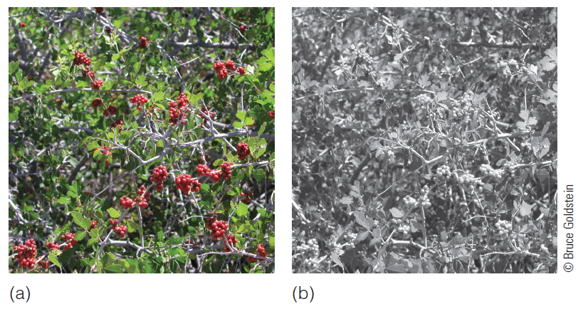

???

Figure 9.1 (a) Red berries in green foliage. (b) These berries become more difficult to detect without color vision.

---

## Functions of Color Perception

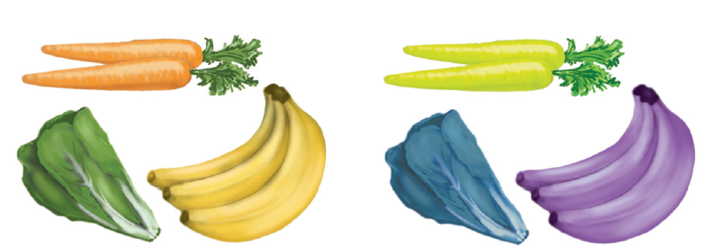

???

Figure 9.2 Subjects in Tanaka and Presnell’s (1999) experiment were able to recognize appropriately colored objects like the fruits in (a) more rapidly than inappropriately colored objects like the fruits in (b)


---

## Color and Light
- Newton
    - Thought white light was mixture of many colors
- Individual colors of the spectrum are not mixtures of other colors. 
- The degree to which beams from each part of the spectrum were "bent" by the second prism was different.


---

## Color and Light

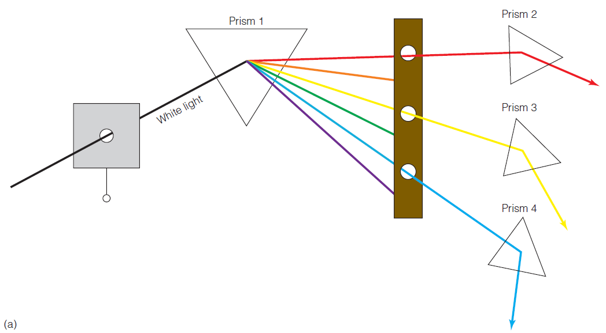

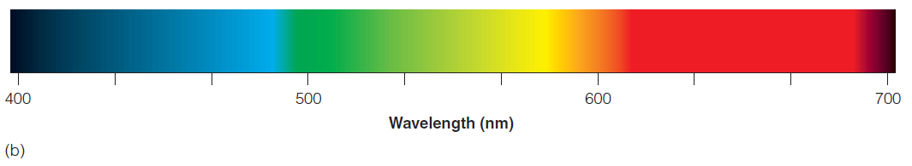
???

Figure 9.3 (a) Diagram of Newton’s prism experiment. Light entered through a hole in the window shade and then passed through the prism. The colors of the spectrum were then separated by passing them through holes in a board. Each color of the spectrum then passed through a second prism. Different colors were bent by different amounts. (b) The visible spectrum


---

## Reflectance and Transmission
- Chromatic colors-blue, green, red
- Selective reflection
- Achromatic colors-gray, black white

---

## Reflectance and Transmission

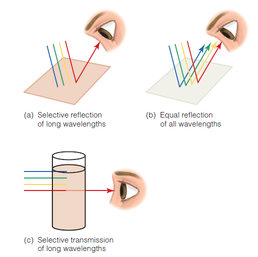

???

Figure 9.4 (a) White light contains all of the wavelengths of the spectrum. A beam of white light is symbolized here by showing beams with wavelengths associated with blue, green, yellow, and red. When white light hits the surface of the paper, the long-wavelength light is selectively reflected and the rest of the wavelengths are absorbed. We therefore perceive the paper as looking red. (b) When all of the wavelengths are reflected equally, we see white. (c) In this example of selective transmission, the long-wavelength light is transmitted and the other wavelengths are absorbed by the liquid.

---

## Reflectance and Transmission

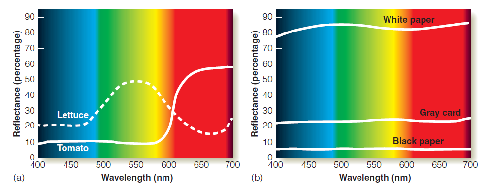

???

Figure 9.5 Reflectance curves for (a) lettuce and tomatoes (adapted from Williamson & Cummins, 1983) and (b) white, gray, and black paper (adapted from Clulow, 1972).

---

## Reflectance and Transmission
- Selective transmission
    - Only some wavelengths pass through objects.
- Transmission curves
    - Plots of the percentage of light are transmitted at each wavelength.

---

## Reflectance and Transmission

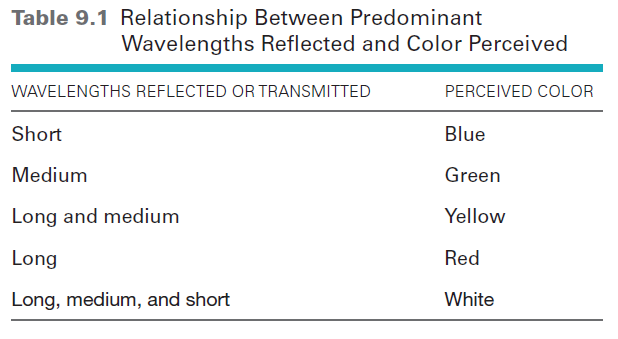

???


---

## Color Mixing
- Additive color mixture:
    - Mixing lights of different wavelengths
- All wavelengths are available for the observer to see.
- Superimposing blue and yellow lights leads to white.
- Subtractive color mixture:
    - Mixing paints with different pigments
- Additional pigments reflect fewer wavelengths.
- Mixing blue and yellow leads to green.

---

## Color Mixing

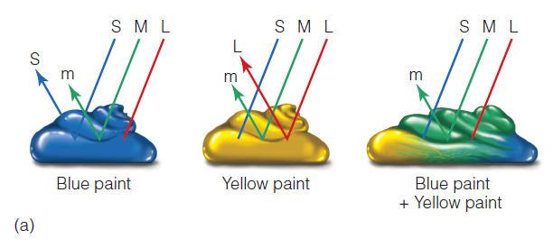

--

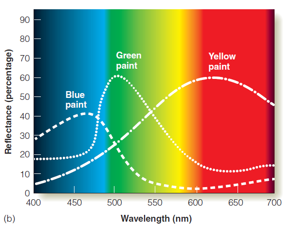

???

Figure 9.6 Color mixing with paint. Mixing blue paint and yellow paint creates a paint that appears green. This is subtractive color mixture


---

## Color Mixing

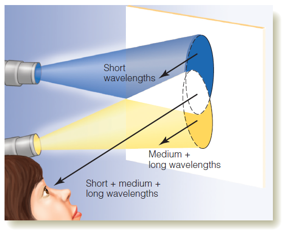

???

Figure 9.7 Color mixing with light. Superimposing a blue light and a yellow light creates the perception of white in the area of overlap. This is additive color mixing.


---

## Perceptual Dimensions of Colors 
- Spectral colors
- Nonspectral colors
- Hues
- Saturation
- Value


---

## Perceptual Dimensions of Colors 

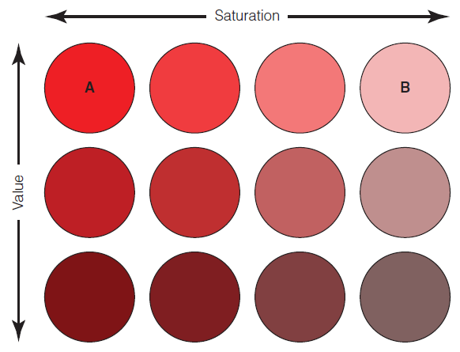

???

Figure 9.8 These 12 color patches have the same hue (red). Saturation decreases from left to right. Brightness decreases from top to bottom


---

## Perceptual Dimensions of Colors 

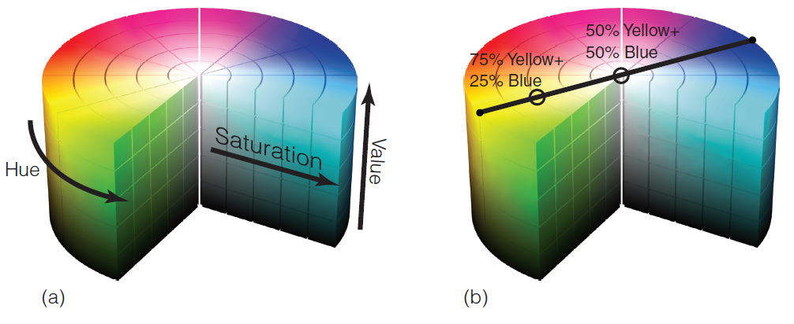

???

Figure 9.9 (a) An example of a color solid. (b) The result of mixing two colored lights will fall on a line connecting the hues that are mixed


---

## The Trichromatic Theory of Color Vision
- Proposed by Young and Helmholtz (1800s)
    - Three different receptor mechanisms are responsible for color vision.
- Behavioral evidence:
    - Color-matching experiments
- Observers adjusted amounts of three wavelengths in a comparison field to match a test field of one wavelength.


---

## The Trichromatic Theory of Color Vision
- Results showed that:
    - It is possible to perform the matching task.
    - Observers with normal color vision need at least three wavelengths to make the matches.
    - Observers with color deficiencies can match colors by using only two wavelengths.

---

## The Trichromatic Theory of Color Vision

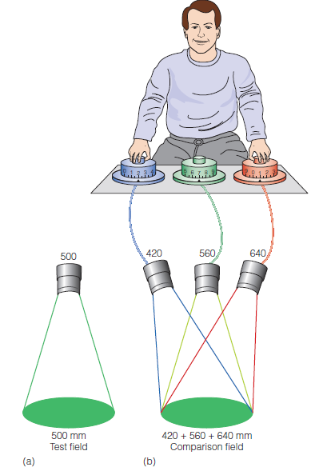

???
Figure 9.10 In a color-matching experiment, the observer adjusts the amount of three wavelengths in one field (right) so that it matches the color of the single wavelength in the other field (left). 


---

## Evidence for the Trichromatic Theory
- Researchers measured absorption spectra of visual pigments in receptors (1960s).
    - They found pigments that responded maximally to:
- Short wavelengths (419nm)
- Medium wavelengths (531nm)
- Long wavelengths (558nm)
- Later researchers found genetic differences for coding proteins for the three pigments (1980s).

---

## Evidence for the Trichromatic Theory

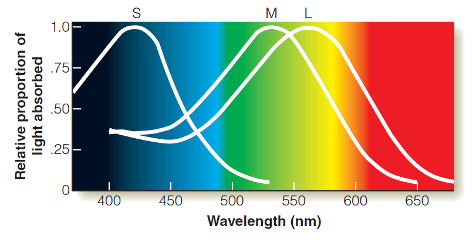

???

Figure 9.11 Absorption spectra of the three cone pigments. 


---

## Cone Responding and Color Perception
- Color perception is based on the response of the three different types of cones.
    - Responses vary depending on the wavelengths available.
    - Combinations of the responses across all three cone types lead to perception of all colors.
    - Color matching experiments show that colors that are perceptually similar (metamers) can be caused by different physical wavelengths.

---

## Cone Responding and Color Perception

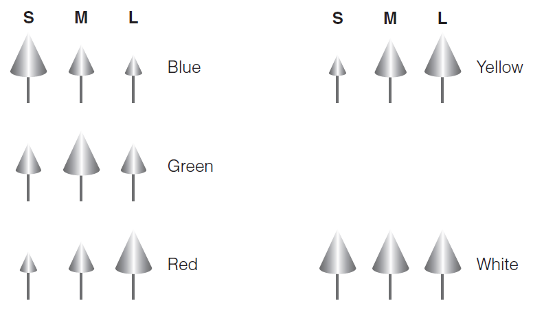

???

Figure 9.12 Patterns of firing of the three types of cones to different colors. The size of the cone symbolizes the size of the receptor’s response

---

## Cone Responding and Color Perception

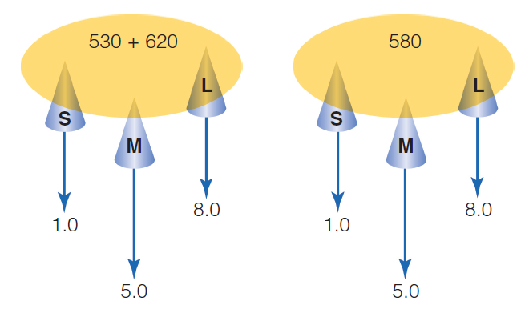

???

Figure 9.13 Principle behind metamerism. The proportions of 530-nm and 620-nm lights in the field on the left have been adjusted so that the mixture appears identical to the 580-nm light in the field on the right. The numbers indicate the responses of the short-, medium-, and long-wavelength receptors. There is no difference in the responses of the two sets of receptors, so the two fields are perceptually indistinguishable. 

---

## Are Three Receptor Mechanisms Necessary for Color Vision?
- One receptor type cannot lead to color vision
    - Absorption of a photon causes the same effect, no matter what the wavelength is.
    - Any two wavelengths can cause the same response by changing the intensity.
- Two receptor types (dichromats) solve this problem, but three types (trichromats) allow for perception of more colors.
- Principle of univariance

---

## Are Three Receptor Mechanisms Necessary for Color Vision?

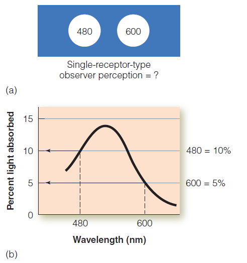

???

Figure 9.14 (a) Two fields, 480 nm on the left and 600 nm on the right. (b) Absorption spectrum of a visual pigment that absorbs 10 percent of 480-nm light and 5 percent of 600-nm light.


---

## Are Three Receptor Mechanisms Necessary for Color Vision?


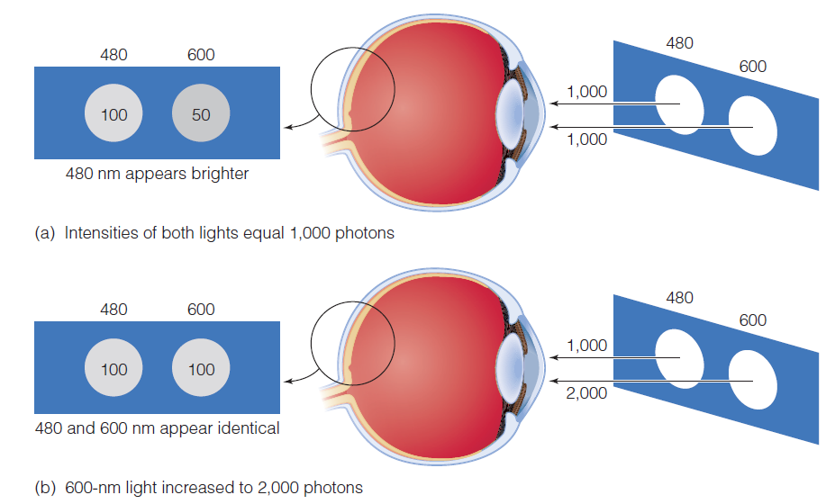

???

Figure 9.15 Calculation of how many molecules of the visual pigment in Figure 9.14 are isomerized (a) when the intensity of both is 1,000 photons. In this case, the 480-nm light isomerizes 100 molecules and the 600-nm light isomerizes 50 molecules, so the 480-nm light would look brighter. (b) When the intensity of the 600-nm light is increased to 2,000, both wavelengths isomerize the same number of molecules, so the two wavelengths are perceived as identical. 

---

## Vision With Two Receptor Types
- Monochromat: person who needs only one wavelength to match any color
- Dichromat: person who needs only two wavelengths to match any color
- Trichromat: person who needs three wavelengths to match any color

---

## The Opponent-Process Theory of Color Vision
- Proposed by Hering (1800s)
    - Color vision is caused by opposing responses generated by blue and yellow, and by green and red.
- Behavioral evidence:
    - Color afterimages and simultaneous color contrast show the opposing pairings
    - Types of color blindness are red/green and blue/yellow.

---

## The Opponent-Process Theory of Color Vision
- Opponent-process mechanism proposed by Hering
    - Three mechanisms: red/green, blue/yellow, and white/black
    - The pairs respond in an opposing fashion, such as positively to red and negatively to green
    - These responses were believed to be the result of chemical reactions in the retina.

---

## The Opponent-Process Theory of Color Vision

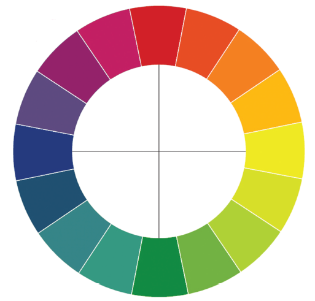

???

Figure 9.17 The color circle described by Hering. Colors on the left all appear yellowish, colors on the right appear bluish, colors on the top appear greenish, and colors on the bottom appear reddish. Lines connect opponent colors.


---

## The Opponent-Process Theory of Color Vision
- Complementary afterimages
    - Red and green switch places and blue and yellow switch places.
- Hue cancellation method

---

## The Opponent-Process Theory of Color Vision


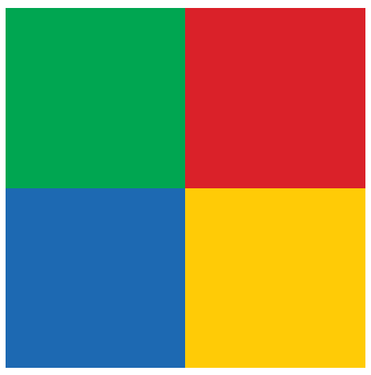

???

Figure 9.19 Display for afterimage demonstration


---

## Evidence for the Opponent-Process Theory
- Researchers performing single-cell recordings found opponent neurons (1950s)
    - Opponent neurons:
- Are located in the retina and LGN
- Respond in an excitatory manner to one end of the spectrum and an inhibitory manner to the other

---

## How Opponent Responding Can Be Created by Three Types of Receptors
- Each theory describes physiological mechanisms in the visual system
    - Trichromatic theory explains the responses of the cones in the retina.
    - Opponent-process theory explains neural response for cells connected to the cones further in the brain. 

---

## How Opponent Responding Can Be Created


???

Figure 9.24 Our experience of color is shaped by physiological mechanisms both in the receptors and in opponent neurons


---

## How Opponent Responding Can Be Created

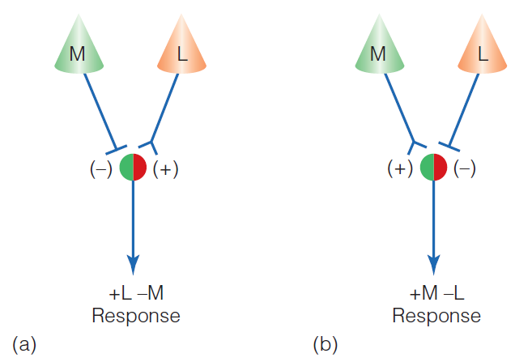

???

Figure 9.25 Neural circuits showing how (a) 1L 2M, (b) 1M 2L, (c) 1S 2ML, and (d) 1ML 2S mechanisms can be created by excitatory and inhibitory inputs from the three types of cone receptors.


---

## Color in the Cortex
- There is no single module for color perception.
    - Cortical cells in V1, and V4 respond to some wavelengths or have opponent responses.
    - These cells usually also respond to forms and orientations.
    - Cortical cells that respond to color may also respond to white.

---

## Color in the Cortex

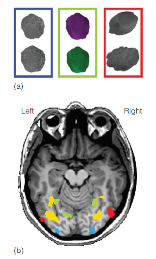

???

Figure 9.27 (a) Stimuli and (b) results from Cavina-Pratesi and coworkers (2010). Green areas selectively responded to color, red areas selectively responded to shape, blue areas selectively responded to texture, and yellow areas responded to all three features

---

## Types of Opponent Neurons in the Cortex
- Single-opponent neurons
- Double-opponent neurons

---

## Types of Opponent Neurons in the Cortex

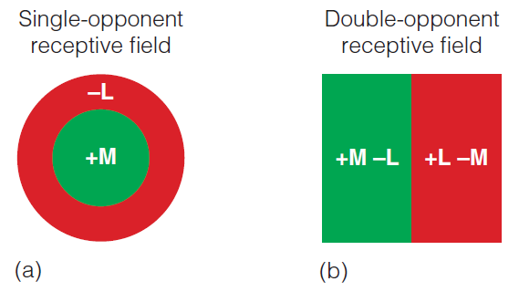

???
Figure 9.28 (a) Receptive field of a single-opponent cortical neuron. This 1M 2L neuron has a center-surround receptive field. Its firing increases when a medium-wavelength light is presented to the center area of the receptive field and decreases when a long-wavelength light is presented to the surrounding area. (b) Receptive field of a double-opponent cortical neuron. This neuron increases firing when a vertical medium-wavelength bar is presented to the left side of the receptive field and when a vertical long-wavelength bar is presented to the right side of the receptive field.


---

## Monochromatism
- Monochromats have:
    - A very rare hereditary condition 
    - Only rods and no functioning cones
    - Ability to perceive only in white, gray, and black tones
    - True color-blindness
    - Poor visual acuity
    - Very sensitive eyes to bright light

---

## Dichromatism
- There are three types of dichromatism
- Protanopia affects 1% of males and .02% of females.	
    - Individuals see short-wavelengths as blue.
    - Neutral point occurs at 492nm.
    - Above neutral point, they see yellow.
    - They are missing the long-wavelength pigment. 

---

## Dichromatism
- Deuteranopia affects 1% of males and .01% of females.
    - Individuals see short-wavelengths as blue.
    - Neutral point occurs at 498nm.
    - Above neutral point, they see yellow.
    - They are missing the medium wavelength pigment.

---

## Dichromatism
- Tritanopia affects .002% of males and .001% of females.
    - Individuals see short wavelengths as blue.
    - Neutral point occurs at 570nm.
    - Above neutral point, they see red.
    - They are most probably missing the short wavelength pigment .

---

## Dichromatism

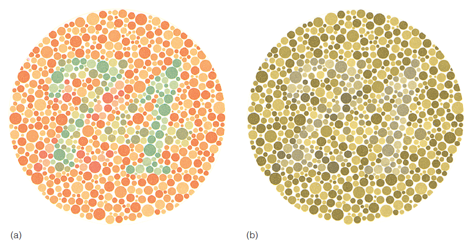

???

Figure 9.29 (a) An example of an Ishihara plate for testing color deficiency. A person with normal color vision sees a “74” when the plate is viewed under standardized illumination. (b) The same Ishihara plate as perceived by a person with a form of red–green color deficiency.

---

## Dichromatism

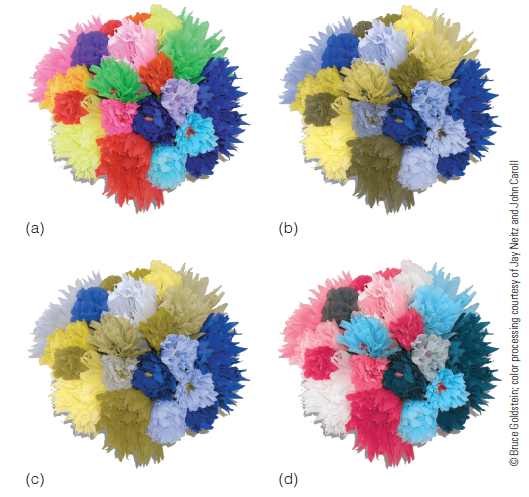

???
Figure 9.30 How colored paper flowers appear to (a) trichromats; (b) protanopes; (c) deuteranopes; and (d) tritanopes. 

---

## Dichromatism

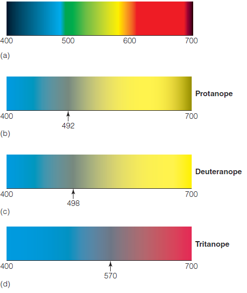

???

Figure 9.31 How the visible spectrum appears to (a) trichromats; (b) protanopes; (c) deuteranopes; and (d) tritanopes. The number indicates the wavelength of the neutral point. 

---

## Color Constancy
- Color constancy: perception of colors as relatively constant in spite of changing light sources
    - Sunlight has approximately equal amounts of energy at all visible wavelengths.
    - Tungsten lighting has more energy in the long    -wavelengths.
    - Objects reflect different wavelengths from these two sources.

---

## Color Constancy
- Chromatic adaptation occurs when prolonged exposure to chromatic color leads to receptors:
    - "Adapting" when the stimulus color selectively bleaches a specific cone pigment
    - Decreasing in sensitivity to the color 
- Adaptation occurs to light sources leading to color constancy.

---

## Color Constancy

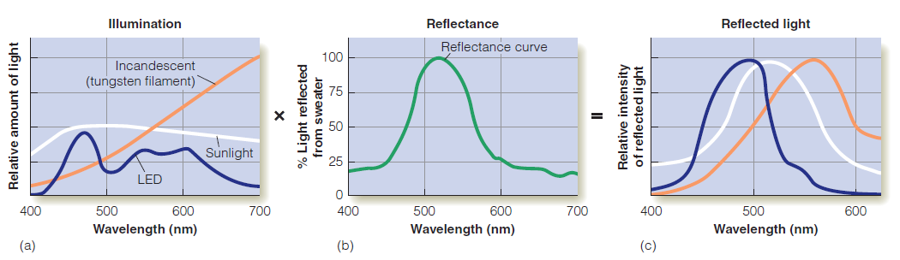

???

Figure 9.32 Determining what wavelengths are reflected from the green sweater under different illuminations. Light reflected from the sweater is determined by multiplying (a) the illumination of sunlight, incandescent, and LED lightbulbs times (b) the sweater’s reflectance. The result is (c) the light reflected from the sweater. The maximum of each of the curves in (c) has been set at the same level to make the wavelength distributions easier to compare

---

## Color Constancy

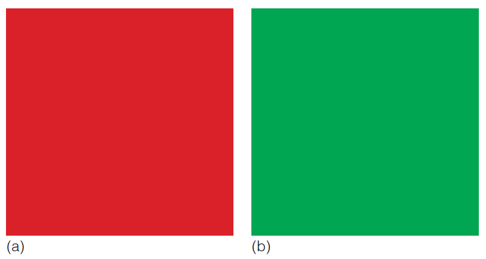

???

Figure 9.33 (a) Red adapting field for “Adapting to Red” demonstration. (b) Green adapting field for “Color and the Surroundings” demonstration 


---

## Color Constancy

- Experiment by Uchikawa et al.
    - Observers shown sheets of colored paper in three conditions:
- **Baseline**: paper and observer in white light
- Observer **not adapted**: paper illuminated by red light; observer by white
- Observer **adapted**: paper and observer in red light

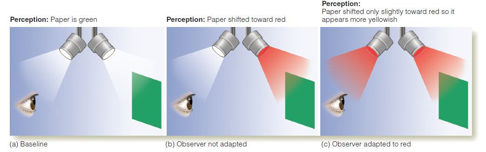


???
Figure 9.34 The three conditions in Uchikawa et al.’s (1989) experiment

---

## Color Constancy
- Uchikawa et al. results:
    - Baseline: green paper is seen as green
    - Observer not adapted: perception of green paper is shifted toward red
    - Observer adapted: perception of green paper is slightly shifted toward red
- Partial color constancy was shown in this condition.


---

## Color Constancy
- Effect of surroundings
    - Color constancy works best when an object is surrounded by many colors.
- Memory and color
    - Past knowledge of an object's color can have an impact on color perception.

---

## Color Constancy


???

Figure 9.35 How chromatic adaptation to the dominant colors of the environment can influence perception of the colors of a scene. The dominant color of the scene in (a) is green. Looking at this scene causes adaptation to green and decreases the perception of green in the scene, as shown in (c). The dominant color of the arid scene in (b) is yellow. Adapting to this scene causes a decreased perception of yellow in the scene, as shown in (d). 

---

## Memory and Color
- Experiment by Hansen et al.
    - Observers saw photographs of fruits with characteristic colors against a gray background.
    - They adjusted the color of the fruit and a spot of light.
    - When the spot was adjusted to physically match the background, the spot appeared gray.
    - But when this was done for the fruits, they were still perceived as being slightly colored.

---

## Lightness Constancy
- Achromatic colors are perceived as remaining relatively constant.
    - Perception of lightness:
- Is not related to the amount of light reflected by an object
- Is related to the percentage of light reflected by an object

---

## Lightness Constancy
- The ratio principle: two areas that reflect different amounts of light look the same if the ratios of their intensities are the same
    - This works when objects are evenly illuminated.

---

## Lightness Constancy

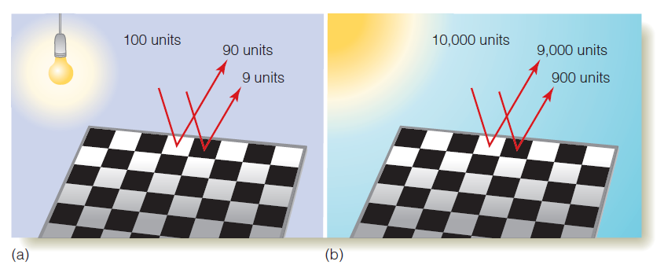

???

Figure 9.36 A black-and-white checkerboard illuminated by (a) tungsten light and (b) sunlight. 


---

## Lightness Perception Under Uneven Illumination
- Lightness perception under uneven illumination
    - Perceptual system must distinguish between:
- Reflectance edges: edges where the amount of light reflected changes between two surfaces
- Illumination edges: edges where lighting of two surfaces changes

---

## Lightness Perception Under Uneven Illumination
- Sources of information about illumination:
    - Information in shadows: system must determine that edge of a shadow is an illumination edge
- System takes into account the meaningfulness of objects.
- Penumbra of shadows signals an illumination edge.

---

## Lightness Perception Under Uneven Illumination

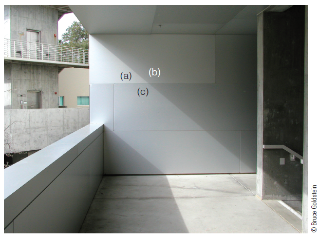

???

Figure 9.37 This unevenly illuminated wall contains both reflectance edges (between a and c) and illumination edges (between a and b). The perceptual system must distinguish between these two types of edges to accurately perceive the actual properties of the wall, and other parts of the scene as well. 

---

## The Information in Shadows

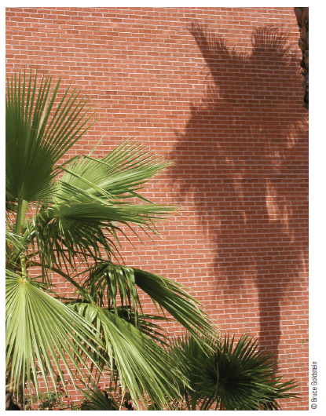

???

Figure 9.38 In this photo, you assume that the shadowed and unshadowed areas are bricks with the same lightness but that less light falls on some areas than on others because of the shadow cast by the tree.

---

## The Information in Shadows

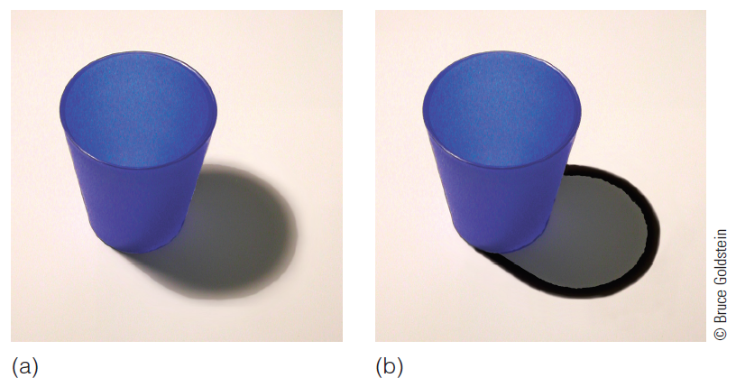

???

Figure 9.39 (a) A cup and its shadow. (b) The same cup and shadow with the penumbra covered by a black border. 


---

## Color Is a Creation of the Nervous System
- Physical energy in the environment does not have perceptual qualities. 
    - Light waves are not "colored."
- Different nervous systems experience different perceptions.
- Honeybees perceive color that is outside human perception.
    - We cannot tell what color the bee actually "sees."

---

## Color Is a Creation of the Nervous System

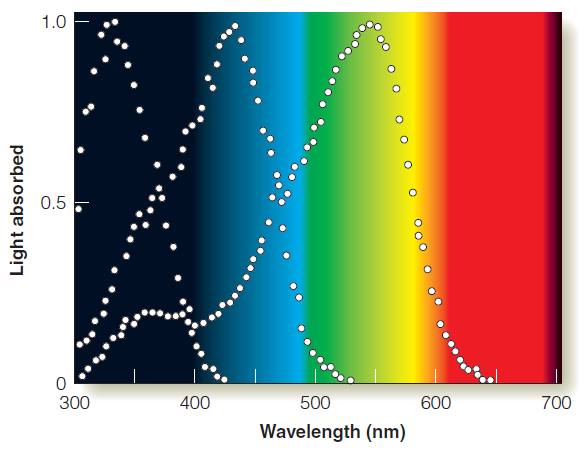

???

Figure 9.43 Absorption spectra of honeybee visual pigments.
---

## Infant Color Vision
- It is a complex problem to know what an infant really "sees."
    - Chromatic color
    - Brightness
- Bornstein et al. (1976)
    - Habituation
    - Young infants have color vision.

---

## Infant Color Vision

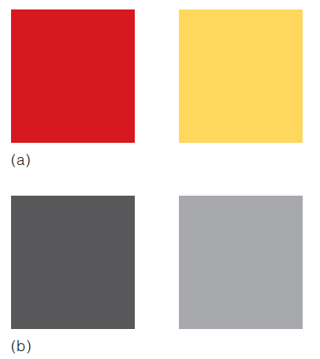
???

Figure 9.45 (a) Two color patches. (b) The same two patches as “seen” by a photocopy machine.


???
